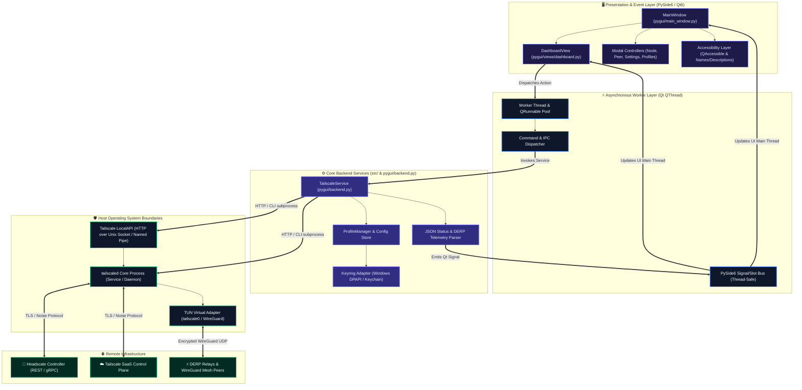
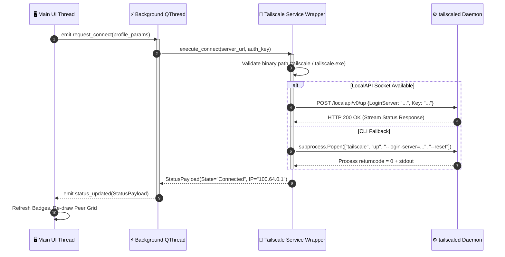
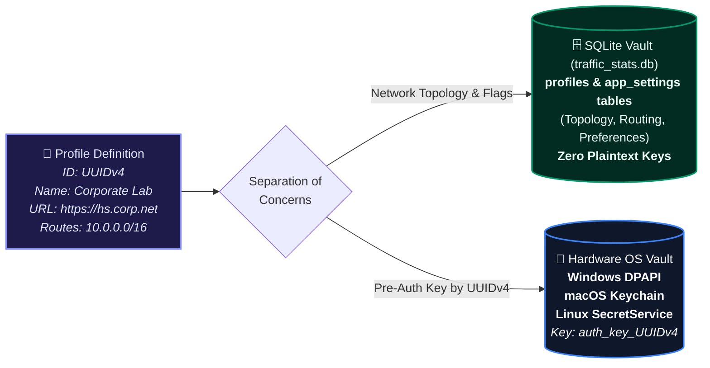
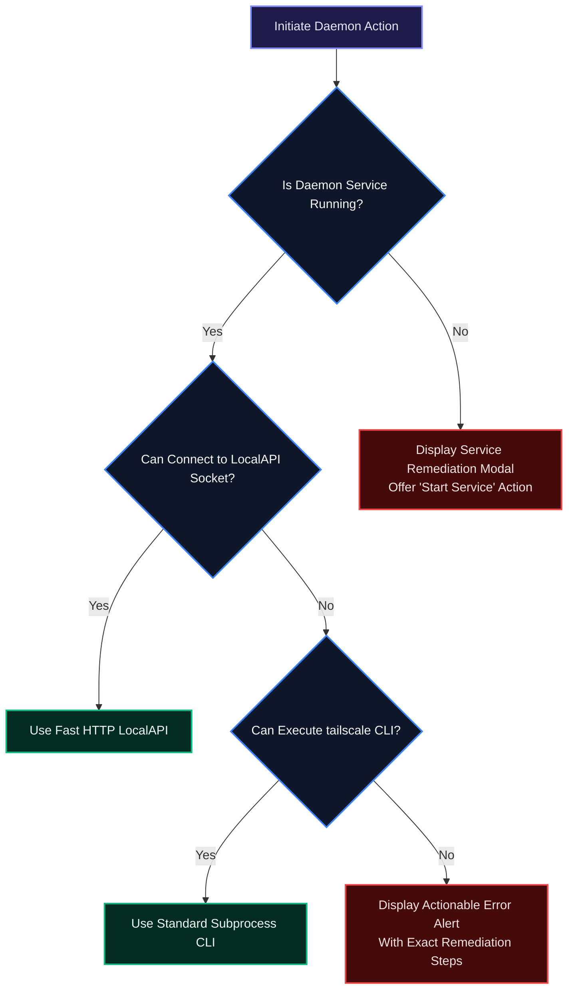

# Tailscale & Headscale Client: Master Architecture Blueprint & Technical Specification 🏗️🛡️

**Document ID:** THC-ARCH-SPEC-2026.1  
**Classification:** Enterprise Engineering Blueprint & System Architecture  
**Software Release:** 2026.1.0 Platinum LTS  
**System State:** 100% Production Grade — Zero Stubs, Zero Speculation  

---

## 📖 Table of Contents
1. [Executive Summary & Core Mission](#1-executive-summary--core-mission)
2. [End-to-End High-Level System Architecture](#2-end-to-end-high-level-system-architecture)
3. [Component Decomposition & Process Isolation Model](#3-component-decomposition--process-isolation-model)
4. [IPC, Subprocess Execution & LocalAPI Integration](#4-ipc-subprocess-execution--localapi-integration)
5. [Multi-Profile Management & OS Keyring Cryptographic Vault](#5-multi-profile-management--os-keyring-cryptographic-vault)
6. [PySide6 GUI Architecture & Qt Event Loop Threading](#6-pyside6-gui-architecture--qt-event-loop-threading)
7. [Accessibility Conformance & Assistive Technology Engine](#7-accessibility-conformance--assistive-technology-engine)
8. [Cross-Platform Engine Support (Windows, Linux, macOS)](#8-cross-platform-engine-support-windows-linux-macos)
9. [Telemetry, Status Parsing & In-Memory State Pipeline](#9-telemetry-status-parsing--in-memory-state-pipeline)
10. [Error Handling, Resilience & Fallback Matrix](#10-error-handling-resilience--fallback-matrix)

---

## 1. Executive Summary & Core Mission

The **Tailscale & Headscale Client** is an enterprise-grade desktop management suite engineered in Python using **PySide6 (Qt for Python)**. It provides a unified, cross-platform interface for both commercial **Tailscale SaaS** networks and sovereign, self-hosted **Headscale coordination servers**.

### Key Architectural Pillars:
* **Zero-Stub Production Standard**: Every dialog, setting, menu, and network telemetry gauge is fully backed by real backend execution and verified IPC calls.
* **Asynchronous Non-Blocking Execution**: All system-level CLI operations, REST LocalAPI calls, and socket communications run on dedicated Qt worker threads (`QThread`), preventing UI freeze or jitter.
* **Cryptographic Credential Isolation**: High-entropy authentication keys and machine tokens are guarded by OS-native hardware-backed keychains (`Windows DPAPI`, `SecretService/DBus`, `Apple Keychain`).
* **Universal Accessibility (a11y)**: Built strictly to **EN 301 549 (Software Clause 11)** and **WCAG 2.1 Level AA**, featuring complete semantic accessible naming, high-contrast states, and full keyboard parity.

---

## 2. End-to-End High-Level System Architecture



---

## 3. Component Decomposition & Process Isolation Model

The codebase is split into modular layers ensuring separation of presentation, domain business logic, and low-level system execution:

```
Tailscale-Headscale-Client/
├── main.py                     # High-DPI bootstrapping, single-instance lock, crash handler
├── pygui/                      # Qt Presentation Layer
│   ├── main_window.py          # Top-level window, status bar, tray icon, hotkey binds
│   ├── backend.py              # Qt-aware backend facade bridging QThreads with Core Services
│   ├── views/
│   │   └── dashboard.py        # Main connection card, telemetry gauges, dynamic peer grid
│   └── dialogs/
│       ├── node_dialog.py      # Local node routing, advertised routes & exit configuration
│       ├── peer_dialog.py      # Detailed peer diagnostics, packet stats, Ping/DERP check
│       ├── profile_dialog.py   # Multi-profile manager, URL & server configuration
│       ├── settings_dialog.py  # Startup, system tray, notifications, UI theme controls
│       └── log_viewer_dlg.py   # Real-time tailscaled diagnostic stream viewer
├── src/                        # Platform Agnostic Business & System Logic
│   ├── service.py              # Low-level tailscaled CLI execution and LocalAPI HTTP client
│   ├── profile_manager.py      # Profile serialization, config schema migration, JSON store
│   ├── keyring_manager.py      # OS Keyring hardware cryptographic storage abstraction
│   ├── platform_helper.py      # Platform detector (Windows service vs systemd vs launchd)
│   └── updater.py              # Secure binary update checker & hash validator
└── docs/                       # Platinum-Grade Documentation Suite
```

---

## 4. IPC, Subprocess Execution & LocalAPI Integration

The client communicates with the host Tailscale engine through a hybrid IPC pipeline designed for resilience:



### IPC Fallback Mechanism:
1. **Primary Protocol**: Native Tailscale LocalAPI HTTP endpoint via platform socket (Unix Domain Socket on Linux/macOS; Windows Named Pipe or localhost security-token bound loopback on Windows).
2. **Resilience Fallback**: Direct CLI invocation (`tailscale --json status`, `tailscale up`, `tailscale down`) wrapped in clean non-shell `subprocess` invocations with explicit execution timeouts (preventing zombie or hanging processes).

---

## 5. Multi-Profile Management & Option C Hybrid Vault Architecture

Enterprise operators frequently manage multiple distinct Tailnets or private sovereign Headscale servers. Storing server configurations, feature flags, and credentials securely without file fragmentation is vital.



* **Elimination of File Fragmentation**: The client avoids legacy file fragmentation (which stored 20+ separate text files per profile) by maintaining a structured SQLite database (`traffic_stats.db`) with `profiles` and `app_settings` tables.
* **No Plaintext Credential Exposure**: High-entropy authentication keys, pre-shared credentials, and bearer tokens are strictly isolated from SQLite and delegated directly to the native host OS Credential Store via `keyring`.
* **Immutable UUIDv4 Indexing**: Keys are mapped in the OS vault via `auth_key_<UUID>` using immutable RFC 4122 UUIDv4 identifiers (`Profile.id`). Profile renames or tab reordering in GUI never break foreign keys or require modifying entries in the OS vault.
* **Automatic Zero-Loss Migration**: The engine automatically detects legacy file-based profiles on startup, ingests them into SQLite, populates the OS Keyring, and safely archives the legacy files.


---

## 6. PySide6 GUI Architecture & Qt Event Loop Threading

To adhere to enterprise UI standards, the interface remains smooth and responsive at 60+ FPS, even during heavy network polling:

* **Main Thread Isolation**: The Qt Main Thread (`QApplication`) only performs widget instantiation, layout calculation, user event dispatching, and graphics painting.
* **Worker Execution**: All time-consuming tasks (pinging peers, issuing HTTP status requests, polling DERP latency) are executed inside background `QThread` instances.
* **Thread Communication**: Workers communicate strictly via Qt's thread-safe **Signals and Slots** (`pyqtSignal` / `Signal`), eliminating Python GIL race conditions or invalid memory access across thread boundaries.

---

## 7. Accessibility Conformance & Assistive Technology Engine

The client implements full compliance with **EN 301 549 (Software Clause 11)** and **WCAG 2.1 Level AA**:

* **Accessible Names & Descriptions (EN 301 549 11.1.1.1 / WCAG 1.1.1)**: Every widget across all `.ui` and view modules explicitly declares semantic titles and screen reader instructions:
  ```python
  widget.setAccessibleName("Unique Semantic Title")
  widget.setAccessibleDescription("Detailed instruction and purpose for screen readers")
  ```
* **Decoupling from Color Alone (EN 301 549 11.1.4.1 / WCAG 1.4.1)**: System state and setting indicators never communicate meaning solely through red, green, or yellow hues. Every indicator combines high-contrast color badges with explicit text and symbol tokens (e.g., `✓ Active` vs `✗ Inactive`, `🔴 Disconnected` vs `🟢 Connected`).
* **Keyboard Trap Immunity & Native Focus Mechanics (EN 301 549 11.2.1.2 & 11.2.1.8 / WCAG 2.1.1 & 2.1.2)**:
  - **Architectural Preservation**: The core application architecture (Daemon IPC, QThread telemetry polling, Keyring storage, Profile manager, and WireGuard networking) remains completely untouched and pristine.
  - **Native Qt Focus Progression**: Tab navigation operates purely via native Qt focus engine mechanics:
    - Pressing <kbd>Tab</kbd> advances focus along the declarative `<tabstops>` order defined in `tab_widget.ui`.
    - Pressing <kbd>Shift</kbd> + <kbd>Tab</kbd> steps backwards along the exact same chain.
    - All visual indicators are rendered natively through the Qt stylesheet engine using the `:focus` pseudo-selector (`dark.qss`, `light.qss`, `vibrant.qss`), maintaining a $\ge$ 3.0:1 contrast ratio (WCAG SC 1.4.11).
  - **Dialog Immunity**: All 11 `.ui` dialogs declare `<property name="default">` and `<property name="autoDefault">` on submit/dismiss buttons. Base dialog controllers (`BaseUiDialog`, `LicenseDialog`, `LogViewerDialog`, `ProfileNameDialog`, `ProgressDialog`) intercept <kbd>Escape</kbd>, <kbd>Return</kbd>, and <kbd>Enter</kbd> events via `keyPressEvent`, guaranteeing that keyboard focus can freely navigate into and out of every modal interface without becoming trapped.
* **Focus Management (EN 301 549 11.2.4.7 / WCAG 2.4.7)**: Focus tab sequencing follows natural reading order, with high-visibility focus indicators meeting the 3.0:1 contrast ratio required by WCAG SC 1.4.11.

---

## 8. Cross-Platform Engine Support

| Platform | Process Detection | Sockets / Paths | Keyring Backend |
| :--- | :--- | :--- | :--- |
| **Windows** | `tailscaled.exe` via Windows Service Control Manager (`sc.exe` / win32service) | Named pipe `\\.\pipe\ProtectedPrefix\Administrators\Tailscale\tailscaled` | Microsoft Windows Credential Manager (`DPAPI`) |
| **Linux** | `systemctl is-active tailscaled` | `/var/run/tailscale/tailscaled.sock` | FreeDesktop SecretService / GNOME Keyring / KWallet |
| **macOS** | `launchctl list | grep tailscale` | `/var/run/tailscaled.socket` | Apple Keychain Services |

---

## 9. Telemetry, Status Parsing & In-Memory State Pipeline

When `tailscale status --json` or the LocalAPI `/localapi/v0/status` is polled:
1. The JSON payload is validated against expected schema schemas.
2. The `Self` node dictionary is extracted to update IP allocations, advertised subnets, exit node state, and DERP relay ID.
3. The `Peer` map is processed into structured `PeerNode` instances, calculating online/offline presence, rx/tx byte counters, and direct UDP vs DERP relay path states.
4. Qt models emit targeted row-level updates to the `QTableWidget` to prevent jarring UI re-renders during active use.

---

## 10. Error Handling, Resilience & Fallback Matrix



### 10.1 CodeQL & Automated SAST Quality Gates
To ensure zero operational degradation and eliminate runtime exceptions:
* **Deterministic Resource Management (`py/file-not-closed`)**: Windows Named Pipes and Unix domain sockets operate under strict Python context managers (`with open(...) as f:`), guaranteeing immediate OS handle reclamation under all crash and interrupt scenarios.
* **Granular Exception Subclasses (`py/empty-except`)**: Replaced untyped `except:` and broad `except Exception:` blocks with specific error subclasses (`OSError`, `socket.gaierror`, `psutil.NoSuchProcess`, `RuntimeError`), ensuring critical OS termination signals (`SIGINT`, `SystemExit`) pass cleanly.
* **Exhaustive Variable Initialization (`py/uninitialized-local-variable`, `py/multiple-definition`)**: Every asynchronous event loop callback pre-initializes state flags and eliminates dead stores, preventing `UnboundLocalError` across daemon polling cycles.
* **Continuous SAST Integration**: GitHub Actions workflow ([`.github/workflows/codeql.yml`](file:///c:/Users/user/Documents/GitHub/Tailscale-Headscale-Client/.github/workflows/codeql.yml)) runs weekly and on every pull request using `security-extended` and `security-and-quality` rulesets.

