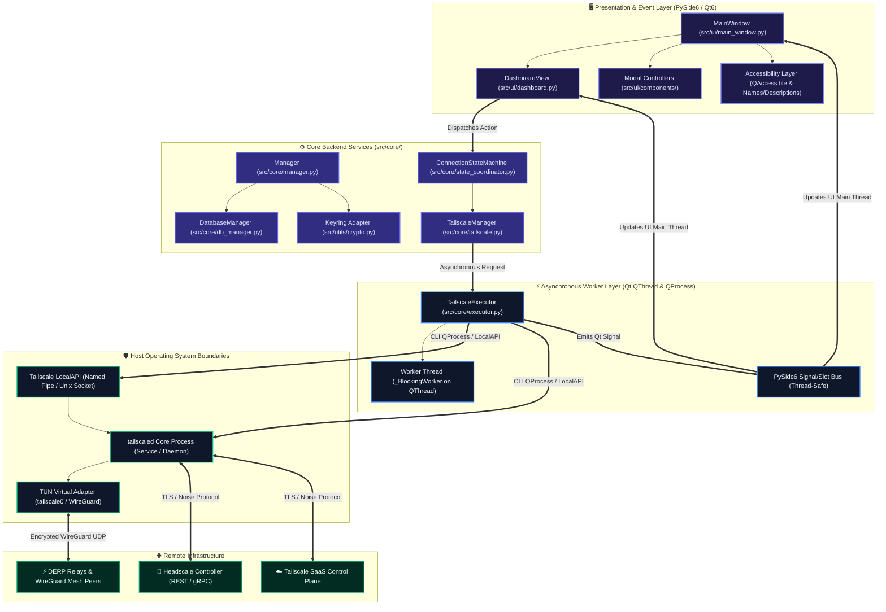
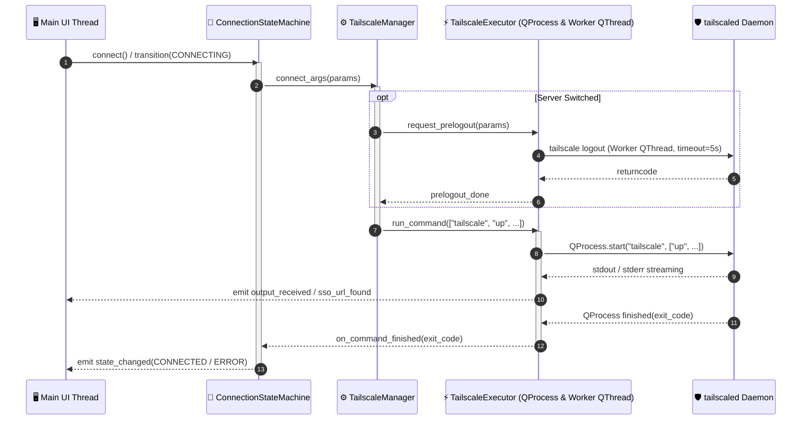
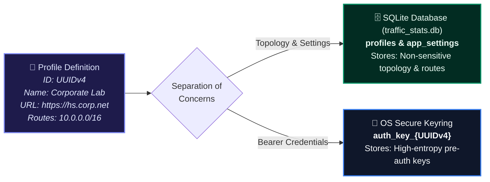
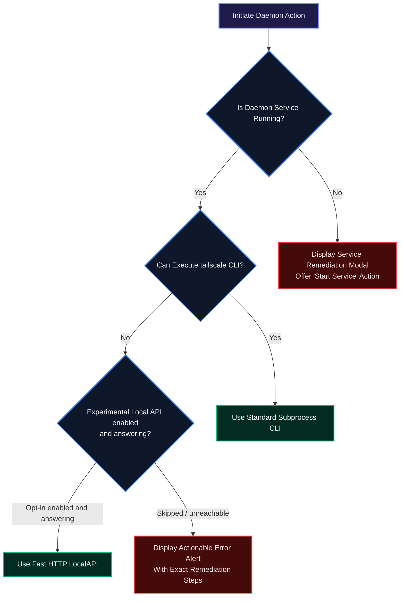

# Tailscale & Headscale Client: Master Architecture Blueprint & Technical Specification 🏗️🛡️

**Document ID:** THC-ARCH-SPEC-5.0  
**Classification:** Enterprise Engineering Blueprint & System Architecture  
**Software Release:** 5.0.0  
**System State:** Verified Codebase Implementation  

---

## 📖 Table of Contents
1. [Executive Summary & Core Mission](#1-executive-summary--core-mission)
2. [End-to-End High-Level System Architecture](#2-end-to-end-high-level-system-architecture)
3. [Component Decomposition & Process Isolation Model](#3-component-decomposition--process-isolation-model)
4. [IPC, Subprocess Execution & LocalAPI Integration](#4-ipc-subprocess-execution--localapi-integration)
5. [Multi-Profile Management & OS Keyring Cryptographic Vault](#5-multi-profile-management--os-keyring-cryptographic-vault)
6. [PySide6 GUI Architecture & Qt Event Loop Threading](#6-pyside6-gui-architecture--qt-event-loop-threading)
7. [Accessibility Conformance & Assistive Technology Engine](#7-accessibility-conformance--assistive-technology-engine)
8. [Cross-Platform Engine Support (Windows, Linux, macOS)](#8-cross-platform-engine-support-windows-linux-macos)
9. [Telemetry, Status Parsing & In-Memory State Pipeline](#9-telemetry-status-parsing--in-memory-state-pipeline)
10. [Error Handling, Resilience & Fallback Matrix](#10-error-handling-resilience--fallback-matrix)

---

## 1. Executive Summary & Core Mission

The **Tailscale & Headscale Client** is an enterprise-grade desktop management suite engineered in Python using **PySide6 (Qt for Python)**. It provides a unified, cross-platform interface for both commercial **Tailscale SaaS** networks and sovereign, self-hosted **Headscale coordination servers**.

### Key Architectural Pillars:
* **Zero-Stub Production Standard**: Every dialog, setting, menu, and network telemetry gauge is fully backed by real backend execution and verified IPC calls.
* **Asynchronous Non-Blocking Execution**: All system-level CLI operations, REST LocalAPI calls, and socket communications run on dedicated Qt worker threads (`QThread`), preventing UI freeze or jitter.
* **Cryptographic Credential Isolation**: High-entropy authentication keys and machine tokens are guarded by OS-native hardware-backed keychains (`Windows DPAPI`, `SecretService/DBus`, `Apple Keychain`).
* **Universal Accessibility (a11y)**: Built strictly to **EN 301 549 (Software Clause 11)** and **WCAG 2.1 Level AA**, featuring complete semantic accessible naming, high-contrast states, and full keyboard parity.

---

## 2. End-to-End High-Level System Architecture



---

## 3. Component Decomposition & Process Isolation Model

The codebase is split into modular layers ensuring clear separation of presentation, domain business logic, and low-level system execution:

```
Tailscale-Headscale-Client/
├── main.py                     # Entry point: --dns-fallback & --self-test routing, crash handlers, installer mutex, QLockFile
├── src/                        # Platform-Agnostic Core & Presentation Engine
│   ├── core/
│   │   ├── executor.py         # TailscaleExecutor: unified async seam, QProcess & QThread worker with timeouts
│   │   ├── state_coordinator.py# ConnectionStateMachine: single source of truth, exponential backoff, SSO timers
│   │   ├── tailscale.py        # TailscaleManager: pure execution facade delegating to executor & state machine
│   │   ├── manager.py          # Manager: Option C Hybrid Vault orchestrator (SQLite + OS Keyring)
│   │   ├── db_manager.py       # DatabaseManager: SQLite stats, profile topology & PRAGMA user_version migrations
│   │   ├── cache_manager.py    # Local JSON cache for status debouncing and rapid GUI startup
│   │   └── models.py           # Core dataclasses (Profile, AppSettings, AppState enums)
│   ├── ui/
│   │   ├── main_window.py      # Top-level QMainWindow, tab controllers, system tray, theme switcher
│   │   ├── dashboard.py        # DashboardView: profile cards, status indicators, and control buttons
│   │   └── components/
│   │       ├── peer_dialog.py  # Peer table, packet stats, Ping & Netcheck via TailscaleExecutor
│   │       ├── node_dialog.py  # Exit node picker, advertised routes configuration
│   │       ├── diagnostics_dialog.py # Netcheck runner & accessibility self-check
│   │       ├── settings_dialog.py    # Preferences (incl. the Experimental Local API toggle)
│   │       ├── log_viewer_dlg.py     # Live-tailing log viewer with level filters and ZIP export
│   │       └── simple_dialogs.py     # Modal dialogs (About, License, Readme, Traffic)
│   └── utils/
│       ├── crypto.py           # OS Keyring SecretStore adapter (with test mock backend)
│       ├── crash_handler.py    # sys/threading excepthook + Qt message routing into app.log
│       ├── self_check.py       # --self-test bundle/database validation used by CI packaging
│       ├── dns_fallback.py     # Emergency hosts-file pinning with elevated UAC CLI routing
│       ├── local_api.py        # Tailscale daemon LocalAPI client (opt-in, timeouts, CLI fallback)
│       ├── logger.py           # Structured logging, credential scrubbing, NullWriter fallback
│       ├── a11y_checker.py     # Screen reader assistive technology detector
│       └── autostart.py        # Platform-specific OS autostart helpers (Registry, launchd w/ launchctl, .desktop)
└── Docs/                       # System Architecture, Security, and Compliance Specifications
```

---

## 4. IPC, Subprocess Execution & LocalAPI Integration

The client communicates with the host Tailscale engine through a hybrid IPC pipeline designed for resilience:



### IPC & Status Polling Mechanism:
1. **Interactive Commands (`tailscale up`, `switch`, `logout`)**: Handled asynchronously via streaming `QProcess` in `TailscaleExecutor`. Never blocks the Qt GUI event loop.
2. **Telemetry & Status Queries**: Fetched with non-blocking `tailscale status --json` on the dedicated `_BlockingWorker` thread — this is the default path. When **"Enable Experimental Local API"** is ticked in Settings (opt-in, off by default), the LocalAPI socket (`/localapi/v0/status` over Named Pipe on Windows, Unix domain socket on Linux/macOS) is attempted first with a 2-second timeout, and the CLI is used as the fallback. A refused pipe (HTTP 401/403 — e.g. a non-elevated Windows session, since that pipe is administrators-only) is reported as such and falls back to the CLI.

---

## 5. Multi-Profile Management & Option C Hybrid Vault Architecture

Enterprise operators frequently manage multiple distinct Tailnets or private sovereign Headscale servers. Storing server configurations, feature flags, and credentials securely without file fragmentation is vital.



* **Elimination of File Fragmentation**: The client avoids legacy file fragmentation (which stored 20+ separate text files per profile) by maintaining a structured SQLite database (`traffic_stats.db`) with `profiles` and `app_settings` tables.
* **No Plaintext Credential Exposure**: High-entropy authentication keys, pre-shared credentials, and bearer tokens are strictly isolated from SQLite and delegated directly to the native host OS Credential Store via `keyring`.
* **Immutable UUIDv4 Indexing**: Keys are mapped in the OS vault via `auth_key_<UUID>` using immutable RFC 4122 UUIDv4 identifiers (`Profile.id`). Profile renames or tab reordering in GUI never break foreign keys or require modifying entries in the OS vault.
* **Automatic Zero-Loss Migration**: The engine automatically detects legacy file-based profiles on startup, ingests them into SQLite, populates the OS Keyring, and safely archives the legacy files.


---

## 6. PySide6 GUI Architecture & Qt Event Loop Threading

The desktop interface uses PySide6 with native Qt signal-slot dispatching:
* **Decoupled Architecture**: View widgets (`DashboardView`, `PeerDialog`, `NodeDialog`) communicate strictly via signals and delegate all execution to `ConnectionStateMachine` and `TailscaleExecutor`.
* **Zero UI Freezing**: Long-running status calls, ping diagnostics, and prelogouts run on `_BlockingWorker` off the GUI thread.
* **Themes & High-Contrast**: Supports native light/dark stylesheets and optional dynamic `qt-material` accents.

---

## 7. Accessibility Conformance & Assistive Technology Engine

The client implements full compliance with **EN 301 549 (Software Clause 11)** and **WCAG 2.1 Level AA**:

* **Accessible Names & Descriptions (EN 301 549 11.1.1.1 / WCAG 1.1.1)**: Every widget across `.ui` and view modules explicitly declares semantic titles and screen reader instructions via `setAccessibleName` and `setAccessibleDescription`.
* **Decoupling from Color Alone (EN 301 549 11.1.4.1 / WCAG 1.4.1)**: System state and setting indicators combine high-contrast color badges with explicit text tokens.
* **Keyboard Trap Immunity (EN 301 549 11.2.1.2 & 11.2.1.8 / WCAG 2.1.1 & 2.1.2)**: All modal dialogs intercept <kbd>Esc</kbd> and <kbd>Enter</kbd> events, and focus sequencing follows logical `<tabstops>`.

---

## 8. Cross-Platform Engine Support

| Platform | Process Detection | Sockets / Paths | Keyring Backend |
| :--- | :--- | :--- | :--- |
| **Windows** | `tailscale status --json` probe (start via `net start Tailscale`) | Named pipe `\\.\pipe\ProtectedPrefix\Administrators\Tailscale\tailscaled` | Microsoft Windows Credential Manager (`DPAPI`) |
| **Linux** | `tailscale status --json` probe (start via `systemctl start tailscaled`) | `/var/run/tailscale/tailscaled.sock` | FreeDesktop SecretService / GNOME Keyring / KWallet |
| **macOS** | `tailscale status --json` probe (start via `launchctl start com.tailscale.tailscaled`) | `/var/run/tailscale/tailscaled.sock` (App Store build: `/Library/Containers/io.tailscale.ipn.macos/Data/tailscaled.sock`) | Apple Keychain Services |

---

## 9. Telemetry, Status Parsing & In-Memory State Pipeline

When `tailscale status --json` or the LocalAPI `/localapi/v0/status` is polled:
1. The JSON payload is parsed into dictionary format.
2. The `BackendState` (e.g. `Running`, `NeedsLogin`, `NeedsMachineAuth`) is mapped to unified `(is_connected, status_text, ips)` tuples via `status_from_json()`.
3. Self node IP addresses (`TailscaleIPs`) and peer metrics are displayed on the dashboard without blocking the main event loop.
4. Traffic deltas are buffered thread-safely in `DatabaseManager` and flushed periodically to `traffic_data` in SQLite.

---

## 10. Error Handling, Resilience & Fallback Matrix



### 10.1 CodeQL & Automated SAST Quality Gates
To ensure zero operational degradation and eliminate runtime exceptions:
* **Deterministic Resource Management (`py/file-not-closed`)**: Windows Named Pipes and Unix domain sockets operate under strict Python context managers (`with open(...) as f:`), guaranteeing immediate OS handle reclamation under all crash and interrupt scenarios.
* **Granular Exception Subclasses (`py/empty-except`)**: Replaced untyped `except:` and broad `except Exception:` blocks with specific error subclasses (`OSError`, `socket.gaierror`, `psutil.NoSuchProcess`, `RuntimeError`), ensuring critical OS termination signals (`SIGINT`, `SystemExit`) pass cleanly.
* **Exhaustive Variable Initialization (`py/uninitialized-local-variable`, `py/multiple-definition`)**: Every asynchronous event loop callback pre-initializes state flags and eliminates dead stores, preventing `UnboundLocalError` across daemon polling cycles.
* **Continuous SAST Integration**: GitHub Actions workflow ([`.github/workflows/codeql.yml`](file:///c:/Users/user/Documents/GitHub/Tailscale-Headscale-Client/.github/workflows/codeql.yml)) runs weekly and on every pull request using `security-extended` and `security-and-quality` rulesets.

