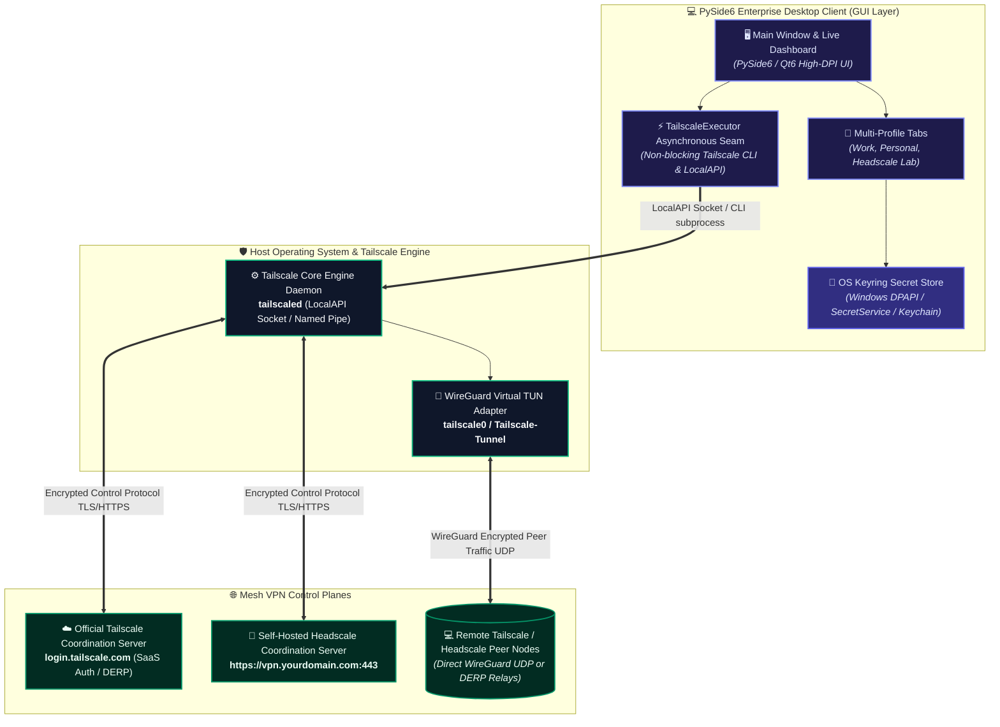
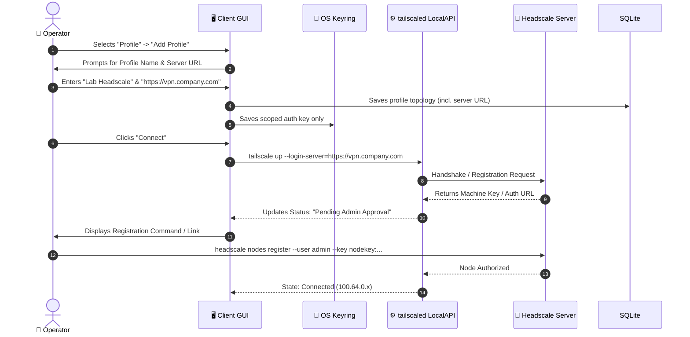

# Tailscale & Headscale Client: Enterprise Quick-Start & Operational Runbook ⚡🚀

**Document ID:** THC-OPS-RUN-5.0  
**Classification:** Enterprise Operations Runbook & Rapid Deployment Guide  
**Client Version:** 5.0.0  
**Target Audience:** Network Administrators, Field Engineers & First-Time Operators  

---

## 1. System Topology & Architecture

This application is a cross-platform, enterprise-grade desktop management suite for **Tailscale** and self-hosted **Headscale** mesh VPN networks. It bridges local OS-level networking daemons with a modern, high-contrast, accessibility-certified PySide6 graphical user interface.



---

## 2. Prerequisites & Requirements Matrix

### 2.1 System Requirements

| Operating System | Supported Versions | Architecture | Required Daemon Service |
| :--- | :--- | :--- | :--- |
| **Microsoft Windows** | Windows 10 (1809+) & Windows 11 / Server 2019+ | x86_64, ARM64 | Tailscale Windows Service (`tailscaled.exe`) |
| **Linux (Debian/Ubuntu/RHEL/Arch)** | Ubuntu 20.04+, Debian 11+, Fedora 38+, Arch Linux | x86_64, aarch64 | `systemctl status tailscaled` |
| **Apple macOS** | macOS 12 Monterey, 13 Ventura, 14 Sonoma, 15 Sequoia | Apple Silicon & Intel | Tailscale daemon / CLI package |

---

## 3. Installation & First-Time Launch

1. Clone or extract the repository.
2. Install dependencies:
   ```bash
   pip install -r requirements.txt
   ```
3. Run the client:
   ```bash
   python main.py
   ```

---

## 4. Connecting to a Headscale Server

1. In the main window tab bar, click the **`+`** (Add Profile) button.
2. Enter a name for your profile (e.g. `Headscale Lab`).
3. In the profile dashboard, click **`Change Credentials`**:
   - **Login Server URL**: Enter your Headscale URL (e.g. `https://headscale.internal.net`).
   - **Auth Key**: (Optional) Paste a pre-authenticated key generated by your Headscale administrator.
4. Click **`Save`**.
5. Click **`Connect`**.

---

## 5. Everyday Operational Workflows

### 5.1 Toggling Exit Nodes
* From the **`Advanced`** menu, click **`Exit Node Selection`**.
* Choose an advertised exit node from the list and apply.

### 5.2 Peer Inspection & Diagnostics
* Open **`Advanced`** $\to$ **`Peer List...`** to view all nodes on the Tailnet, their IP addresses, ping latencies, and relay states.
* Open **`Advanced`** $\to$ **`Network Diagnostics...`** to run netcheck tests.

---

## 6. Troubleshooting & Health Diagnostics

| Symptom / Error | Root Cause | Immediate Remediation |
| :--- | :--- | :--- |
| **"Tailscale daemon not running"** | The background OS service `tailscaled` is stopped or not installed. | **Windows**: Run `Start-Service Tailscale` in PowerShell (Admin).<br>**Linux**: Run `sudo systemctl restart tailscaled`.<br>**macOS**: Launch Tailscale app or restart daemon. |
| **"Failed to authenticate with Headscale"** | Expired pre-auth key or untrusted SSL/TLS certificate. | 1. Ensure Headscale URL begins with `https://`.<br>2. Generate a fresh key via `headscale preauthkeys create`.<br>3. Check server clock synchronization (NTP). |
| **"Keyring storage unavailable"** | Missing secret storage backend on headless Linux systems. | Install `gnome-keyring` or `libsecret-1-0`. The application logs a warning and prevents silent token drops. |

---

## 7. Standards & Compliance References

* **Secret Protection**: Auth tokens and pre-shared credentials are never stored in plaintext on disk; all secrets are bound to host OS encrypted Keyring (Windows DPAPI, macOS Keychain, Linux SecretService).
* **Accessibility**: Fully conforms to **EN 301 549 (Clause 11)** and **WCAG 2.1 Level AA** standards with keyboard and screen reader parity ([`Docs/ACCESSIBILITY_COMPLIANCE.md`](file:///c:/Users/user/Documents/GitHub/Tailscale-Headscale-Client/Docs/ACCESSIBILITY_COMPLIANCE.md)).
* **Security & Vulnerability Management**: Documented in [`Docs/SECURITY.md`](file:///c:/Users/user/Documents/GitHub/Tailscale-Headscale-Client/Docs/SECURITY.md) and [`Docs/SECURITY_ADVISORIES.md`](file:///c:/Users/user/Documents/GitHub/Tailscale-Headscale-Client/Docs/SECURITY_ADVISORIES.md).

### 2.2 Software Runtimes
* **Python**: 3.10, 3.11, 3.12, or 3.13 (Virtual environment recommended).
* **Tailscale Engine**: Tailscale v1.50+ installed on host machine.
* **Dependencies**: see `requirements.txt` — `PySide6>=6.6.0,<7`, `qt-material>=2.14,<3`, `cryptography>=42,<50`, `keyring>=24,<26`, `psutil>=5.9,<8`, `requests>=2.31,<3`, `markdown>=3.5,<4`, `pygments>=2.16,<3`, `beautifulsoup4>=4.12,<5`, plus the build/CI toolchain (`PyInstaller`, `mypy`, `ruff`, `pytest`, `types-psutil`, `types-Markdown`).

---

## 3. Step-by-Step Initial Deployment

### 3.1 Step 1: Install Tailscale Core Service

Before launching the management client, ensure the official Tailscale daemon is installed on your OS:

```bash
# On Windows (PowerShell as Administrator via winget)
winget install Tailscale.Tailscale

# On Ubuntu / Debian
curl -fsSL https://tailscale.com/install.sh | sh

# On macOS (via Homebrew)
brew install tailscale
```

Verify daemon status:
```bash
tailscale version
```

---

### 3.2 Step 2: Clone Repository & Virtual Environment Setup

```bash
# 1. Clone the repository
git clone https://github.com/Arean82/Tailscale-Headscale-Client.git
cd Tailscale-Headscale-Client

# 2. Create Python virtual environment
python -m venv venv

# 3. Activate virtual environment
# Windows PowerShell:
.\venv\Scripts\Activate.ps1
# Windows Command Prompt:
.\venv\Scripts\activate.bat
# Linux / macOS:
source venv/bin/activate

# 4. Install all production dependencies
pip install --upgrade pip
pip install -r requirements.txt
```

---

### 3.3 Step 3: Launching the Application

Execute the application entry point:
```bash
python main.py
```

The system will start, detect your host OS, probe the local `tailscaled` daemon (via the `tailscale` CLI — or through the LocalAPI if *Enable Experimental Local API* is ticked), load stored profiles from SQLite plus the OS keyring, and display the primary status dashboard.

---

## 4. Zero-to-Connected in 3 Minutes

### Option A: Connecting to Official Tailscale (SaaS)

1. Open the application. If not connected, the status badge will indicate **`Disconnected`** in grey.
2. Ensure the active profile **tab** is the one you want (e.g. `Default`).
3. Click the prominent **`Connect`** button (or press <kbd>Ctrl</kbd>+<kbd>Return</kbd>).
4. Your default web browser will automatically open the secure Tailscale authentication page:
   - Authenticate with your Identity Provider (Google, Microsoft, GitHub, Apple, or SSO).
5. Once authenticated, the browser window will confirm login, and the Client Dashboard will immediately transition to **`Connected`** with a green badge, populating your IP (`100.x.y.z`), Tailnet domain, and live peer table.

---

### Option B: Connecting to a Self-Hosted Headscale Server

Connecting to Headscale requires setting your private server coordination URL:



1. In the top navigation bar, click **`Profile`** $\to$ **`Add New Profile`** (or click the **`➕`** tab button).
2. In the profile creation dialog:
   - **Profile Name**: e.g., `Enterprise Headscale`
   - **Login Server URL**: Enter your Headscale server address (e.g., `https://headscale.internal.net`).
   - *(Optional)* **Auth Key**: If your administrator generated a pre-authenticated key (`headscale preauthkeys create -u default`), paste it here.
3. Click **`Save`**.
4. Select the newly created tab from the active profile tabs bar.
5. Click **`Connect`** (or press <kbd>Ctrl</kbd>+<kbd>Return</kbd>).
   - If using interactive registration: Copy the Node Key presented by the dialog and execute on your Headscale controller:
     ```bash
     headscale nodes register --user <your-username> --key <machine-key>
     ```
6. The dashboard will automatically turn green and show your allocated overlay subnet address.

---

## 5. Everyday Operational Workflows

### 5.1 Toggling Exit Nodes (Routing All Internet Traffic)
* Open **`Advanced`** $	o$ **`Advanced Options...`** (or enable the tray switcher below).
* Select the peer advertising an exit route in the **`Exit Node`** dropdown (e.g., `sg-gateway-01`).
* Tick **`Allow LAN (--exit-node-allow-lan-access)`** if you still wish to reach your local printer/router.
* Click **`Save`**, then **`Connect`** (or `Logout` then `Connect` if you are already connected). All outbound traffic is now encrypted and routed through the chosen node.
* To revert to direct breakout, pick **`None (Direct Internet)`** — in the Advanced Options dialog, or from the tray menu when *Enable Quick Exit-Node Switcher* is on.

### 5.2 Network Peer Discovery & Latency Monitoring
* Open the **Peer List** via **Advanced** $\to$ **Peer List...** (or via the system menu).
* Search and filter online peers by hostname, IP address, or user.
* Right-click any peer to copy their primary Tailscale IP address to the clipboard.
* Live telemetry graphs display real-time round-trip latency to active nodes.

---

## 6. Troubleshooting & Health Diagnostics

| Symptom / Error | Root Cause | Immediate Remediation |
| :--- | :--- | :--- |
| **"Tailscale daemon not running"** | The background OS service `tailscaled` is stopped or not installed. | **Windows**: Run `Start-Service Tailscale` in PowerShell (Admin).<br>**Linux**: Run `sudo systemctl restart tailscaled`.<br>**macOS**: Launch Tailscale app or restart daemon via `brew services`. |
| **"Failed to authenticate with Headscale"** | Expired pre-auth key or untrusted SSL/TLS certificate on Headscale server. | 1. Ensure Headscale URL begins with `https://`.<br>2. Generate a fresh key via `headscale preauthkeys create -u <user> --expiration 1h`.<br>3. Verify server clock synchronization (NTP). |
| **"LocalAPI socket access denied"** | GUI running under user account without permission to access the local IPC pipe. | On Linux: Add your user to the tailscale group or verify `/var/run/tailscale/tailscaled.sock` permissions.<br>On Windows: Verify Tailscale Service is running as `LocalSystem`. |
| **"Keyring storage unavailable"** | Missing secret storage backend on headless Linux systems. | Install `gnome-keyring` or `pass` to enable SecretService backing. |

---

## 7. Operational Standards, Procurement & Compliance

* **Zero-Trust Network Architecture (NIST SP 800-207)**: No unencrypted peer-to-peer traffic; all data planes use authenticated WireGuard Noise protocol handshakes.
* **Secret Protection & FIPS Baseline**: Auth tokens and pre-shared credentials are never stored in plaintext on disk; all secrets are bound to host OS encrypted Keyring (Windows DPAPI, macOS Keychain, Linux SecretService).
* **Accessibility (Section 508 & EN 301 549)**: Fully conforms to **EN 301 549 (Clause 11)** and **WCAG 2.1 Level AA** standards with complete keyboard and screen reader parity ([`Docs/ACCESSIBILITY_COMPLIANCE.md`](file:///c:/Users/user/Documents/GitHub/Tailscale-Headscale-Client/Docs/ACCESSIBILITY_COMPLIANCE.md)).
* **Software Supply Chain Security (EO 14028 / NIST SP 800-218)**: Complete CycloneDX v1.5 Software Bill of Materials provided in [`Docs/SBOM.json`](file:///c:/Users/user/Documents/GitHub/Tailscale-Headscale-Client/Docs/SBOM.json).
* **Enterprise Procurement Dossier**: Certified procurement readiness and silent unattended rollout guides documented in [`Docs/ENTERPRISE_PROCUREMENT_READINESS.md`](file:///c:/Users/user/Documents/GitHub/Tailscale-Headscale-Client/Docs/ENTERPRISE_PROCUREMENT_READINESS.md).
