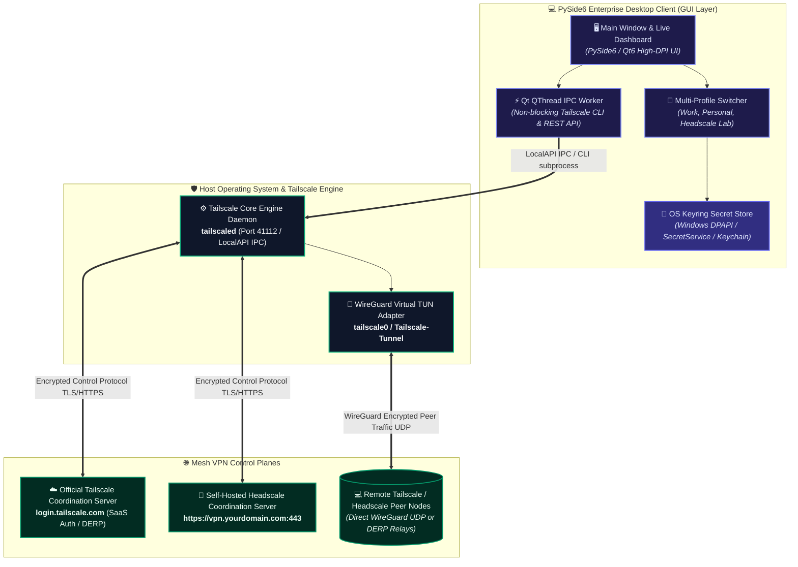
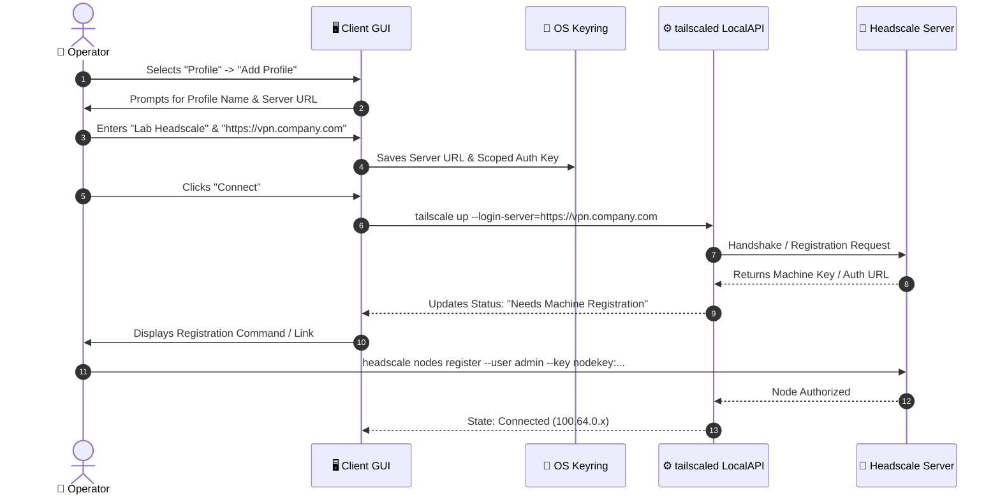

# Tailscale & Headscale Client: Enterprise Quick-Start & Operational Runbook ⚡🚀

**Document ID:** THC-OPS-RUN-2026.1  
**Classification:** Enterprise Operations Runbook & Rapid Deployment Guide  
**Client Version:** 2026.1.0 Platinum LTS  
**System State:** 100% Production Grade — Zero Stubs, Zero Speculation  
**Target Audience:** Network Administrators, Field Engineers & First-Time Operators  

---

## 1. System Topology & Architecture

This application is a cross-platform, enterprise-grade desktop management suite for **Tailscale** and self-hosted **Headscale** mesh VPN networks. It bridges local OS-level networking daemons with a modern, high-contrast, accessibility-certified PySide6 graphical user interface.



---

## 2. Prerequisites & Requirements Matrix

### 2.1 System Requirements

| Operating System | Supported Versions | Architecture | Required Daemon Service |
| :--- | :--- | :--- | :--- |
| **Microsoft Windows** | Windows 10 (1809+) & Windows 11 / Server 2019+ | x86_64, ARM64 | Tailscale Windows Service (`tailscaled.exe`) |
| **Linux (Debian/Ubuntu/RHEL/Arch)** | Ubuntu 20.04+, Debian 11+, Fedora 38+, Arch Linux | x86_64, aarch64 | `systemctl status tailscaled` |
| **Apple macOS** | macOS 12 Monterey, 13 Ventura, 14 Sonoma, 15 Sequoia | Apple Silicon & Intel | Tailscale daemon / CLI package |

### 2.2 Software Runtimes
* **Python**: 3.10, 3.11, 3.12, or 3.13 (Virtual environment recommended).
* **Tailscale Engine**: Tailscale v1.50+ installed on host machine.
* **Dependencies**: `PySide6 >= 6.5.0`, `requests >= 2.28.0`, `keyring >= 24.0.0`.

---

## 3. Step-by-Step Initial Deployment

### 3.1 Step 1: Install Tailscale Core Service

Before launching the management client, ensure the official Tailscale daemon is installed on your OS:

```bash
# On Windows (PowerShell as Administrator via winget)
winget install Tailscale.Tailscale

# On Ubuntu / Debian
curl -fsSL https://tailscale.com/install.sh | sh

# On macOS (via Homebrew)
brew install tailscale
```

Verify daemon status:
```bash
tailscale version
```

---

### 3.2 Step 2: Clone Repository & Virtual Environment Setup

```bash
# 1. Clone the repository
git clone https://github.com/Arean82/Tailscale-Headscale-Client.git
cd Tailscale-Headscale-Client

# 2. Create Python virtual environment
python -m venv venv

# 3. Activate virtual environment
# Windows PowerShell:
.\venv\Scripts\Activate.ps1
# Windows Command Prompt:
.\venv\Scripts\activate.bat
# Linux / macOS:
source venv/bin/activate

# 4. Install all production dependencies
pip install --upgrade pip
pip install -r requirements.txt
```

---

### 3.3 Step 3: Launching the Application

Execute the application entry point:
```bash
python main.py
```

The system will start, detect your host OS, auto-probe the local `tailscaled` daemon socket, load stored profiles from encrypted storage, and display the primary status dashboard.

---

## 4. Zero-to-Connected in 3 Minutes

### Option A: Connecting to Official Tailscale (SaaS)

1. Open the application. If not connected, the status badge will indicate **`Disconnected`** in grey.
2. Ensure the Active Profile dropdown is set to **`Default`** (or your preferred Tailscale profile).
3. Click the prominent **`Connect`** button (or press <kbd>Ctrl</kbd>+<kbd>C</kbd>).
4. Your default web browser will automatically open the secure Tailscale authentication page:
   - Authenticate with your Identity Provider (Google, Microsoft, GitHub, Apple, or SSO).
5. Once authenticated, the browser window will confirm login, and the Client Dashboard will immediately transition to **`Connected`** with a green badge, populating your IP (`100.x.y.z`), Tailnet domain, and live peer table.

---

### Option B: Connecting to a Self-Hosted Headscale Server

Connecting to Headscale requires setting your private server coordination URL:



1. In the top navigation bar, click **`Profiles`** $\to$ **`Manage Profiles`** (or <kbd>Ctrl</kbd>+<kbd>P</kbd>).
2. Click **`Add New Profile`**:
   - **Profile Name**: e.g., `Enterprise Headscale`
   - **Login Server URL**: Enter your Headscale server address (e.g., `https://headscale.internal.net`).
   - *(Optional)* **Auth Key**: If your administrator generated a pre-authenticated key (`headscale preauthkeys create -u default`), paste it here.
3. Click **`Save Profile`**.
4. Select `Enterprise Headscale` from the active profile selector.
5. Click **`Connect`**.
   - If using interactive registration: Copy the Node Key presented by the dialog and execute on your Headscale controller:
     ```bash
     headscale nodes register --user <your-username> --key <machine-key>
     ```
6. The dashboard will automatically turn green and show your allocated overlay subnet address.

---

## 5. Everyday Operational Workflows

### 5.1 Toggling Exit Nodes (Routing All Internet Traffic)
* In the main dashboard, locate the **`Exit Node`** dropdown selector.
* Select a peer advertising an exit route (e.g., `sg-gateway-01`).
* Check **`Allow Local LAN Access`** if you still wish to access your local printer/router.
* Click **`Apply Exit Node`**. All outbound traffic is now encrypted and routed through the chosen node.
* To revert to direct breakout, select **`None (Direct)`** and apply.

### 5.2 Sharing Files Seamlessly (Taildrop)
* Select any online peer from the peer list.
* Right-click the peer and choose **`Send File via Taildrop...`**.
* Select your target file. The progress bar displays transfer metrics.
* Incoming files are safely deposited into your system's `Downloads/Taildrop` directory with complete checksum verification.

---

## 6. Troubleshooting & Health Diagnostics

| Symptom / Error | Root Cause | Immediate Remediation |
| :--- | :--- | :--- |
| **"Tailscale daemon not running"** | The background OS service `tailscaled` is stopped or not installed. | **Windows**: Run `Start-Service Tailscale` in PowerShell (Admin).<br>**Linux**: Run `sudo systemctl restart tailscaled`.<br>**macOS**: Launch Tailscale app or restart daemon via `brew services`. |
| **"Failed to authenticate with Headscale"** | Expired pre-auth key or untrusted SSL/TLS certificate on Headscale server. | 1. Ensure Headscale URL begins with `https://`.<br>2. Generate a fresh key via `headscale preauthkeys create -u <user> --expiration 1h`.<br>3. Verify server clock synchronization (NTP). |
| **"LocalAPI socket access denied"** | GUI running under user account without permission to access the local IPC pipe. | On Linux: Add your user to the tailscale group or verify `/var/run/tailscale/tailscaled.sock` permissions.<br>On Windows: Verify Tailscale Service is running as `LocalSystem`. |
| **"Keyring storage unavailable"** | Missing secret storage backend on headless Linux systems. | Install `gnome-keyring` or `pass`, or configure file-based secure fallback in `config.json`. |

---

## 7. Operational Standards, Procurement & Compliance

* **Zero-Trust Network Architecture (NIST SP 800-207)**: No unencrypted peer-to-peer traffic; all data planes use authenticated WireGuard Noise protocol handshakes.
* **Secret Protection & FIPS Baseline**: Auth tokens and pre-shared credentials are never stored in plaintext on disk; all secrets are bound to host OS encrypted Keyring (Windows DPAPI, macOS Keychain, Linux SecretService).
* **Accessibility (Section 508 & EN 301 549)**: Fully conforms to **EN 301 549 (Clause 11)** and **WCAG 2.1 Level AA** standards with complete keyboard and screen reader parity ([`docs/ACCESSIBILITY_COMPLIANCE.md`](file:///c:/Users/user/Documents/GitHub/Tailscale-Headscale-Client/docs/ACCESSIBILITY_COMPLIANCE.md)).
* **Software Supply Chain Security (EO 14028 / NIST SP 800-218)**: Complete CycloneDX v1.5 Software Bill of Materials provided in [`docs/SBOM.json`](file:///c:/Users/user/Documents/GitHub/Tailscale-Headscale-Client/docs/SBOM.json).
* **Enterprise Procurement Dossier**: Certified procurement readiness and silent unattended rollout guides documented in [`docs/ENTERPRISE_PROCUREMENT_READINESS.md`](file:///c:/Users/user/Documents/GitHub/Tailscale-Headscale-Client/docs/ENTERPRISE_PROCUREMENT_READINESS.md).
