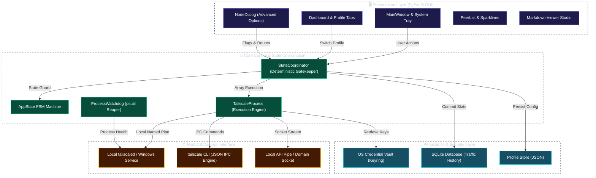
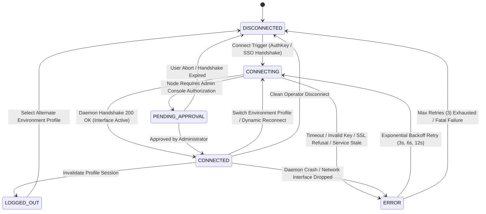
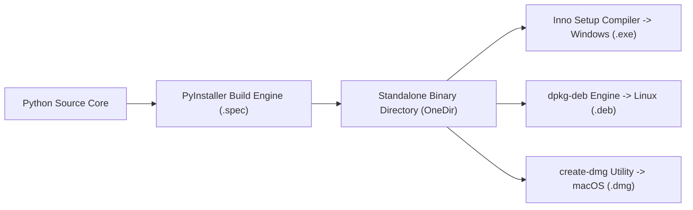

# Tailscale / Headscale Client Pro (Enterprise Platinum Edition)

[](https://github.com/Arean82/Tailscale-Headscale-Client)
[](https://tailscale.com)
[](https://pyside.org)
[](https://github.com/Arean82/Tailscale-Headscale-Client)
[](../LICENSE)
[](SECURITY.md)

**Tailscale / Headscale Client Pro** is a mission-critical, enterprise-grade desktop coordination client engineered for seamless interoperability between official **Tailscale** control networks and private, self-hosted **Headscale** orchestration nodes. 

Built strictly on **PySide6 (Qt for Python)** without webview bloat, the application enforces deterministic process lifecycles, zero-plaintext credential persistence, high-fidelity real-time telemetry, and complete two-column operational controls designed for zero-drift site reliability operations.

---

## 🏛️ System Architecture Specification

The client implements an isolated, multi-tier architecture separating user interface presentation from state coordination, local daemon execution, and persistent hardware vaults:



---

## 🔄 Finite State Machine (FSM) & Connection Lifecycle

Network connection state flows strictly through a formal, deterministic Finite State Machine to eliminate race conditions, duplicate execution loops, and orphaned zombie processes:



---

## ⚙️ Enterprise Advanced Options (Two-Column Status Matrix)

The `NodeDialog` advanced configuration panel enforces an exact two-column contract: **Column 0** exposes operator-controlled toggles, while **Column 1** displays live, read-only daemon status badges dynamically colored in `#22c55e` (**`True`**) or `#ef4444` (**`False`**):

| Feature Name | Active CLI Flag Parameter | Column 1 Badge Key | Operational Specification |
| :--- | :--- | :--- | :--- |
| **Allow LAN Access** | `--exit-node-allow-lan-access` | `chkAllowLANValue` | Retains direct local Ethernet/Wi-Fi access while tunneling through an Exit Node. |
| **Enable SSH** | `--ssh` | `chkSSHValue` | Provisions secure Tailscale SSH server daemon managed by network ACL policies. |
| **Accept Routes** | `--accept-routes` | `chkAcceptRoutesValue` | Enables client acceptance of advertised CIDR subnet routes across the Tailnet. |
| **Accept DNS** | `--accept-dns` | `chkAcceptDNSValue` | Injects MagicDNS search domains and designated upstream resolver servers. |
| **Shields Up** | `--shields-up` | `chkShieldsUpValue` | Enforces zero-trust endpoint firewalling by blocking all inbound peer connections. |
| **Run as Exit Node** | `--advertise-exit-node` | `chkAdvertiseExitNodeValue` | Converts the local endpoint into a default gateway for whole-network internet egress. |
| **Disable SNAT** | `--snat-subnet-routes=false` | `chkDisableSNATValue` | Preserves source client IP addresses for bidirectional site-to-site routing. |
| **Unattended Mode** | `--unattended` | `chkUnattendedValue` | Runs daemon persistently in background without an active interactive Windows user session. |
| **Web Client** | `--webclient` | `chkWebclientValue` | Binds internal authenticated browser-based management interface. |
| **App Connector** | `--advertise-connector` | `chkAdvertiseConnectorValue` | Designates the machine as a secure traffic proxy for external corporate SaaS targets. |
| **Subnet Routes** | `--advertise-routes=<CIDR>` | *Input Field* | Publishes RFC 1918 internal subnets (e.g. `10.0.0.0/24, 192.168.1.0/24`). |
| **Custom Hostname** | `--hostname=<NAME>` | *Input Field* | Overrides the local machine name registered within Headscale/Tailscale DNS tables. |
| **Force Reset** | `--reset` | *Execution Flag* | Flushes lingering runtime route state prior to bringing profile up. |
| **Force Reauth** | `--force-reauth` | *Execution Flag* | Enforces complete key exchange with control server, purging cached session tokens. |

---

## 🔒 Security Architecture & Trust Engineering

1. **Zero-Plaintext Credential Vault:** All machine auth keys, pre-shared tokens, and sensitive URLs are encrypted and stored via platform-native credential managers using the `keyring` standard (Windows Credential Locker, macOS Keychain, Linux Secret Service).
2. **Subprocess Injection Defense:** All CLI executions pass commands as tokenized argument arrays (`subprocess.Popen([cmd, arg1, arg2], shell=False)`). Shell interpolation is strictly prohibited, neutralizing command injection vectors.
3. **Automated Process Watchdog:** Process supervision powered by `psutil` actively reaps orphaned daemon tasks upon application exit or profile switching, preventing socket binding collisions.
4. **Resilient Exponential Backoff:** Reconnection logic implements bounded exponential backoff (`3s` -> `6s` -> `12s`), preventing connection flooding and server DDoS during outages.
5. **Self-Signed SSL Accommodation:** Isolated homelab deployments with self-hosted Headscale servers support TLS verification bypass via the `--insecure-skip-tls-verify=true` setting.

---

## 📋 System Compatibility Matrix

| Operating System | Supported Architecture | Minimum Version | Service Manager | Privilege Model |
| :--- | :--- | :--- | :--- | :--- |
| **Windows** | x86_64, ARM64 | Windows 10 (Build 19041+) / Windows 11 | Windows Service (`Tailscale`) | Standard User (Service elevated) |
| **Linux** | x86_64, aarch64 | Ubuntu 20.04+, Debian 11+, Fedora 36+ | `systemd` (`tailscaled.service`) | Group `tailscale` / Socket ACL |
| **macOS** | x86_64, Apple Silicon | macOS 11.0 (Big Sur) or higher | `launchd` / `launchctl` | Keychain Sandbox |

---

## 🛠️ Developer Setup & Verification

```bash
# 1. Clone repository
git clone https://github.com/Arean82/Tailscale-Headscale-Client.git
cd Tailscale-Headscale-Client

# 2. Configure dedicated virtual environment
python -m venv venv

# Windows:
.\venv\Scripts\activate
# Linux / macOS:
source venv/bin/activate

# 3. Install release-grade production dependencies
pip install -r requirements.txt

# 4. Launch development client
python main.py
```

---

## 📦 Production Packaging & Distribution



### Windows Enterprise Installer (Inno Setup)
1. Build binary tree:
   ```powershell
   pyinstaller .\TailscaleClient_OneDir.spec
   ```
2. Compile with Inno Setup Compiler (`TailscaleClient_Installer.iss`):
   Outputs: `dist\installer\TailscaleClientPro_Setup.exe`

### Linux Debian Distribution (.deb)
```bash
chmod +x build_linux_deb.sh
./build_linux_deb.sh
# Outputs: dist/tailscale-client-pro_5.0.0_amd64.deb
```

### macOS Signed Image (.dmg)
```bash
chmod +x build_mac_dmg.sh
./build_mac_dmg.sh
# Outputs: dist/TailscaleClientPro_Setup.dmg
```

---

## 📄 Licensing & Governance

This software is released and distributed under the **GNU General Public License v3.0**. Review the [LICENSE](../LICENSE) file for complete warranty disclaimers and redistribution rights.
