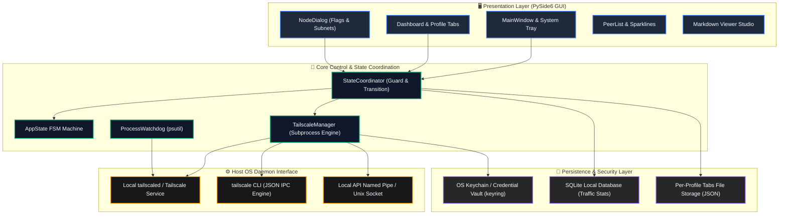
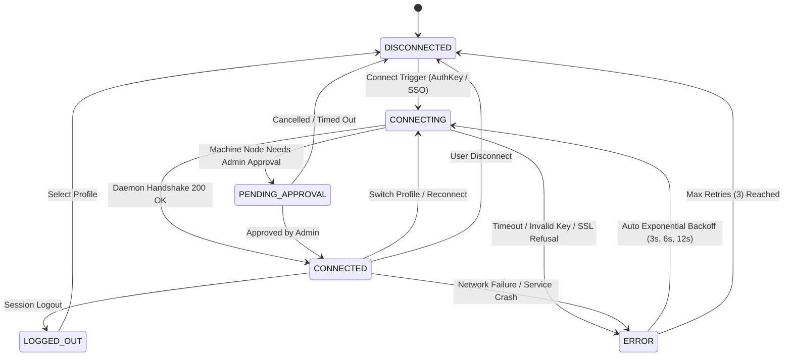
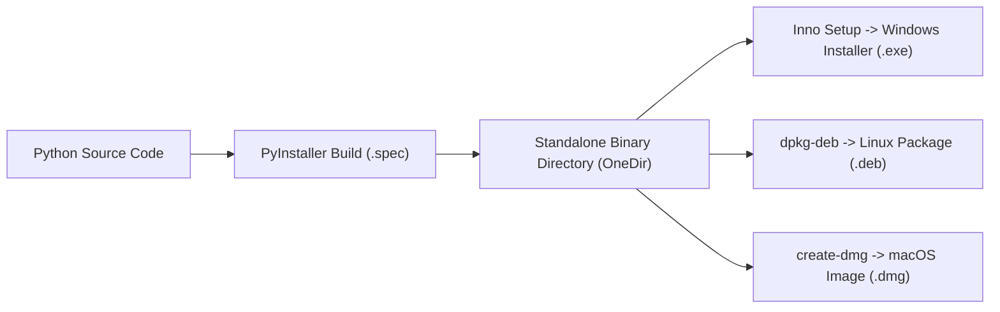

# Tailscale / Headscale Client Pro (PySide6 Enterprise Edition)

[](https://tailscale.com) [](https://pyside.org) [](https://github.com/Arean82/Tailscale-Headscale-Client) [](../LICENSE) [](https://www.python.org)

**Tailscale / Headscale Client Pro** is a release-grade, high-performance desktop GUI application engineered for unified coordination with official **Tailscale** networks and self-hosted **Headscale** control servers. Built with **PySide6 (Qt for Python)**, it combines rock-solid daemon orchestration, real-time telemetry, cryptographic token storage, and a responsive interface tailored for mission-critical deployments.

---

## 🏛️ System Architecture

The client follows a strict separation of concerns across presentation, domain coordination, process execution, and persistent storage:



---

## 🔄 State Machine & Connection Lifecycle

Connection states are strictly managed through a deterministic Finite State Machine (FSM) to prevent race conditions, stale sockets, and zombie background processes:



---

## ✨ Enterprise Feature Suite

### 🎨 Visual & UX Excellence
- **Unified QSS Dynamic Theming:** Zero hardcoded styling in Python logic. Interfaces are themed cleanly via external `.qss` style sheets (`assets/themes/dark.qss` and `light.qss`).
- **Real-Time Latency Sparklines:** Antialiased connection quality graphs rendered at 2-second sampling cadences with automated health classification (`<32ms` green, `<70ms` amber, `>70ms` red).
- **Interactive Markdown Viewer Studio:** Embedded high-fidelity Markdown engine supporting local image resolution, GitHub task checklists, table formatting, and secure external URL delegation.
- **Micro-State Animations:** Smooth window transitions, pulse connection heartbeat, and contextual feedback during daemon synchronization.
- **Multilingual Support (i18n):** Native internationalization in English (`en_US`), Arabic (`ar_SA` with full RTL layout), Spanish (`es_ES`), and French (`fr_FR`).

### ⚡ Power Features & Smart Routing
- **Dual Headscale + Tailscale Support:** Fully compatible with private self-hosted Headscale control servers via `--login-server=<URL>` and official Tailscale control planes.
- **Granular Advanced Network Options:** Per-profile control of exit nodes, subnet routes (`--advertise-routes`), LAN access (`--exit-node-allow-lan-access`), SNAT preservation (`--snat-subnet-routes=false`), custom hostname overrides, and Tailscale SSH.
- **Two-Column Responsive Flag Grid:** Left-side feature controls coupled with live color-coded status badges (`True` green / `False` red) for real-time daemon state visibility.
- **Subnet Route Auto-Suggestion:** Selecting an exit node automatically extracts advertised routes from peer telemetry, removing manual configuration errors.
- **System Tray Switcher:** Low-latency profile switching and exit node toggling directly from the OS taskbar context menu.
- **Traffic Polling Throttling:** Background network usage statistics poll rate scales down dynamically when the window is minimized to preserve CPU and battery.

### 🛡️ Enterprise Security & Resilience
- **OS Keychain Integration:** Machine keys and auth tokens are encrypted using platform-native secure vaults (`keyring` - Windows Credential Locker, macOS Keychain, Linux Secret Service).
- **Process Watchdog:** `psutil`-powered process tracking forcefully reaps orphaned background CLI processes during abrupt closures to eliminate port and state collisions.
- **Exponential Backoff Engine:** Automated reconnection attempts back off exponentially (`3s`, `6s`, `12s`) to protect servers against connection storming.
- **Self-Signed SSL Tolerance:** Dedicated insecure SSL configuration appends `--insecure-skip-tls-verify=true` for isolated homelab testing.

---

## 📋 System Requirements

### Hardware & Platform
| Platform | Architecture | Minimum Version | Notes |
| :--- | :--- | :--- | :--- |
| **Windows** | x64, ARM64 | Windows 10 (Build 19041+) / Windows 11 | PowerShell enabled |
| **Linux** | x64, aarch64 | Ubuntu 20.04+, Debian 11+, Fedora 36+ | `systemd` required |
| **macOS** | x64, Apple Silicon | macOS 11.0 (Big Sur) or higher | `launchctl` management |

### Core Runtime Dependencies
- **Python:** Version `3.10` or higher
- **Tailscale Daemon:** Background service (`tailscaled` on Unix, Windows `Tailscale` Service) installed and active.

---

## 🛠️ Developer Setup & Execution

### 1. Repository Setup
```bash
git clone https://github.com/Arean82/Tailscale-Headscale-Client.git
cd Tailscale-Headscale-Client
```

### 2. Virtual Environment Configuration
```bash
# Windows (PowerShell)
python -m venv venv
.\venv\Scripts\activate

# Linux / macOS
python3 -m venv venv
source venv/bin/activate
```

### 3. Dependency Installation
```bash
pip install -r requirements.txt
```

### 4. Run Application
```bash
python main.py
```

---

## 📦 Production Packaging & Distribution



### Windows Installer (Inno Setup)
1. Compile binary directory:
   ```powershell
   pyinstaller .\TailscaleClient_OneDir.spec
   ```
2. Compile installer using Inno Setup Compiler (`TailscaleClient_Installer.iss`) to output:
   `dist\installer\TailscaleClientPro_Setup.exe`

### Linux Distribution (.deb)
```bash
chmod +x build_linux_deb.sh
./build_linux_deb.sh
# Outputs: dist/tailscale-client-pro_5.0.0_amd64.deb
```

### macOS Bundle (.dmg)
```bash
chmod +x build_mac_dmg.sh
./build_mac_dmg.sh
# Outputs: dist/TailscaleClientPro_Setup.dmg
```

---

## 📄 License

This software is released under the **GNU General Public License v3.0**. See the [LICENSE](../LICENSE) file for complete terms.
