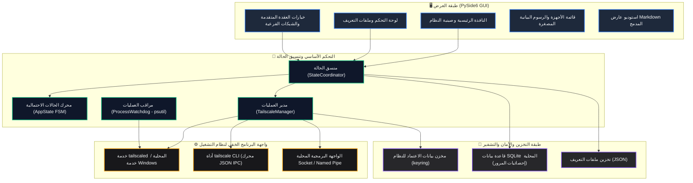
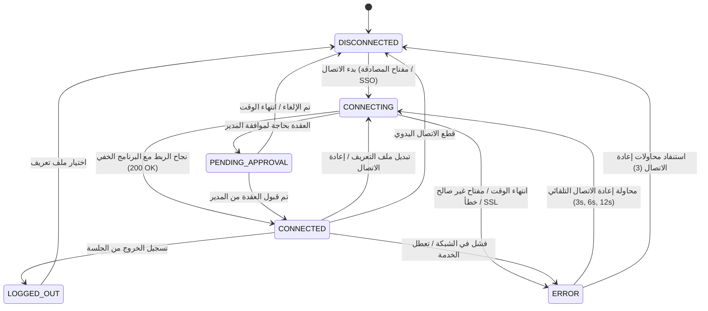
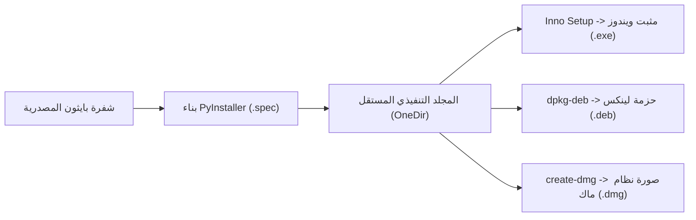

# عميل Tailscale / Headscale برو (إصدار PySide6 للمؤسسات)

[](https://tailscale.com) [](https://pyside.org) [](https://github.com/Arean82/Tailscale-Headscale-Client) [](../LICENSE) [](https://www.python.org)

**Tailscale / Headscale Client Pro** هو تطبيق واجهة مستخدم رسومية (GUI) عالي الأداء ومعد للإنتاج المؤسسي، تم تصميمه للتنسيق الموحد مع شبكات **Tailscale** الرسمية وخوادم التحكم ذاتية الاستضافة **Headscale**. تم بناؤه باستخدام **PySide6 (Qt for Python)**، ويجمع بين التنسيق الصارم للبرنامج الخفي والقياس عن بعد في الوقت الفعلي والتخزين المشفر للرموز المميزة وواجهة سريعة الاستجابة مصممة للمهام الحساسة.

---

## 🏛️ بنية النظام (System Architecture)

يتبع العميل فصلاً صارماً للمسؤوليات عبر طبقة العرض وتنسيق النطاق وتنفيذ العمليات والتخزين الدائم:



---

## 🔄 محرك الحالة ودورة حياة الاتصال (FSM Lifecycle)

تتم إدارة حالات الاتصال بدقة عبر آلة حالات محددة (Finite State Machine) لمنع حالات السباق والمنافذ المعلقة والعمليات الشاردة:



---

## ✨ ميزات المؤسسات المتقدمة

### 🎨 التميز البصري وتجربة المستخدم (UX)
- **مظهر ديناميكي موحد عبر QSS:** فصل كامل بين تصميم الواجهة وشفرة بايثون باستخدام ملفات التنسيق الخارجية `.qss` (`dark.qss` و `light.qss`).
- **رسوم بيانية مصغرة لزمن الاستجابة (Sparklines):** تتبع مباشر وسلس لجودة الاتصال يتم تحديثه كل ثانيتين مع تصنيف تلقائي للجودة (`<32ms` أخضر، `<70ms` برتقالي، `>70ms` أحمر).
- **استوديو عارض Markdown التفاعلي:** محرك متطور مدمج يدعم الصور المحلية وقوائم مهام GitHub وتنسيق الجداول وتحويل الروابط الخارجية بأمان.
- **حركات تفاعلية دقيقة:** انتقالات سلسة للنوافذ ونبضات مؤشر الاتصال وتحديثات فورية أثناء المزامنة.
- **دعم كامل لتعدد اللغات (i18n):** دعم مدمج للغة الإنجليزية (`en_US`)، والعربية (`ar_SA` مع تخطيط كامل من اليمين إلى اليسار RTL)، والإسبانية (`es_ES`)، والفرنسية (`fr_FR`).

### ⚡ قوة الأداء والتوجيه الذكي
- **دعم مزدوج لخوادم Headscale و Tailscale:** متوافق تماماً مع خوادم Headscale المدارة ذاتياً عبر `--login-server=<URL>` وشبكة Tailscale السحابية الرسمية.
- **خيارات شبكية دقيقة ومتقدمة:** تحكم كامل لكل ملف تعريف في عقد الخروج (Exit Nodes)، وتوجيه الشبكات الفرعية (`--advertise-routes`)، والوصول للشبكة المحلية (`--exit-node-allow-lan-access`)، والحفاظ على SNAT (`--snat-subnet-routes=false`)، واسم الجهاز المخصص، وتفعيل Tailscale SSH.
- **شبكة تحكم تفاعلية من عمودين:** خيارات التحكم على اليمين وشارات الحالة اللحظية الملونة على اليسار (`True` أخضر / `False` أحمر) للتحقق المباشر من حالة البرنامج الخفي.
- **اقتراح المسارات التلقائي:** يؤدي تحديد عقدة خروج إلى استخراج المسارات المعلنة تلقائياً من بيانات الأجهزة، مما يلغي أخطاء الإدخال اليدوي.
- **مبدل سريع من صينية النظام:** تبديل ملفات التعريف وعقد الخروج بضغطة زر مباشرة من قائمة شريط المهام.
- **تحسين استهلاك الموارد:** تتباطأ وتيرة قياس إحصائيات المرور تلقائياً عند تصغير النافذة لحفظ المعالج والبطارية.

### 🛡️ أمان واستقرار المؤسسات
- **التكامل مع مخزن مفاتيح النظام:** يتم تشفير مفاتيح الأجهزة ورموز المصادقة باستخدام أدوات النظام الآمنة (`keyring`: Windows Credential Locker و macOS Keychain و Linux Secret Service).
- **مراقب العمليات الصارم (Watchdog):** آلية مدعومة بـ `psutil` لإنهاء العمليات الفرعية المعلقة فور إغلاق التطبيق لمنع تضارب المنافذ أو استهلاك الموارد.
- **محرك التراجع الأسي:** تتضاعف فترات محاولات إعادة الاتصال التلقائية تصاعدياً (`3s`, `6s`, `12s`) لحماية الخوادم من طوفان الطلبات.
- **دعم شهادات SSL الموقعة ذاتياً:** خيار مخصص يضيف `--insecure-skip-tls-verify=true` لتسهيل الاختبارات المعزولة في بيئات العمل المنزلية والمغلقة.

---

## 📋 متطلبات النظام

### العتاد ومنصات التشغيل
| المنصة | المعمارية | الحد الأدنى للإصدار | ملاحظات |
| :--- | :--- | :--- | :--- |
| **ويندوز** | x64, ARM64 | Windows 10 (Build 19041+) / Windows 11 | تفعيل PowerShell |
| **لينكس** | x64, aarch64 | Ubuntu 20.04+, Debian 11+, Fedora 36+ | يتطلب `systemd` |
| **ماك** | x64, Apple Silicon | macOS 11.0 (Big Sur) أو أحدث | إدارة `launchctl` |

### المتطلبات البرمجية الأساسية
- **بايثون:** إصدار `3.10` أو أحدث
- **برنامج Tailscale الخفي:** الخدمة الأساسية (`tailscaled` على يونكس أو خدمة `Tailscale` في ويندوز) مثبتة وقيد التشغيل.

---

## 🛠️ إعداد المطورين والتشغيل

### 1. استنساخ المستودع
```bash
git clone https://github.com/Arean82/Tailscale-Headscale-Client.git
cd Tailscale-Headscale-Client
```

### 2. إعداد البيئة الافتراضية
```bash
# ويندوز (PowerShell)
python -m venv venv
.\venv\Scripts\activate

# لينكس / ماك
python3 -m venv venv
source venv/bin/activate
```

### 3. تثبيت الحزم المطلوبة
```bash
pip install -r requirements.txt
```

### 4. تشغيل التطبيق
```bash
python main.py
```

---

## 📦 حزم الإنتاج والتوزيع



### مثبت ويندوز (Inno Setup)
1. تجميع المجلد التنفيذي:
   ```powershell
   pyinstaller .\TailscaleClient_OneDir.spec
   ```
2. تجميع ملف التثبيت عبر Inno Setup Compiler (`TailscaleClient_Installer.iss`) لإنتاج:
   `dist\installer\TailscaleClientPro_Setup.exe`

### حزمة لينكس (.deb)
```bash
chmod +x build_linux_deb.sh
./build_linux_deb.sh
# الملف الناتج: dist/tailscale-client-pro_5.0.0_amd64.deb
```

### حزمة ماك (.dmg)
```bash
chmod +x build_mac_dmg.sh
./build_mac_dmg.sh
# الملف الناتج: dist/TailscaleClientPro_Setup.dmg
```

---

## 📄 الترخيص

هذا البرنامج مرخص بموجب **رخصة جنو العمومية الإصدار 3.0 (GPLv3)**. راجع ملف [LICENSE](../LICENSE) للاطلاع على الشروط الكاملة.\n