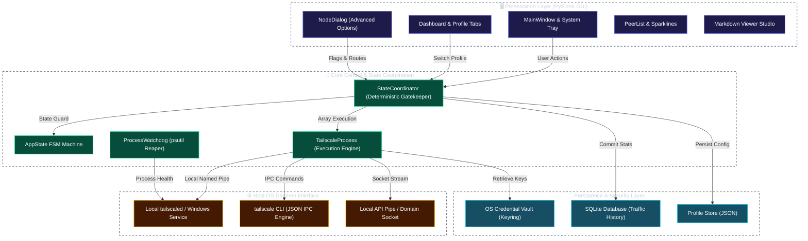
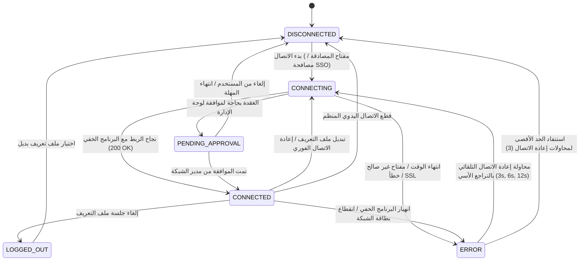
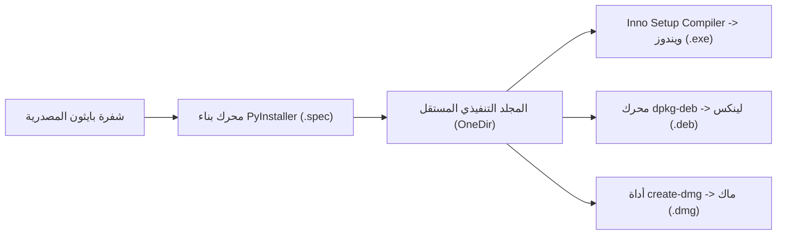

# عميل Tailscale / Headscale برو (إصدار البلاتين للمؤسسات)

[](https://github.com/Arean82/Tailscale-Headscale-Client)
[](https://tailscale.com)
[](https://pyside.org)
[](https://github.com/Arean82/Tailscale-Headscale-Client)
[](../LICENSE)
[](SECURITY.md)

**Tailscale / Headscale Client Pro** هو تطبيق واجهة مستخدم رسومية (GUI) عالي الأداء ومعد للإنتاج المؤسسي الحساس، تم تصميمه للتشغيل المتوافق والآمن بين شبكات **Tailscale** السحابية الرسمية وخوادم التنسيق الخاصة ذاتية الاستضافة **Headscale**.

تم بناؤه بالكامل بالاعتماد على **PySide6 (Qt for Python)** دون الاعتماد على متصفحات الويب المدمجة، ويفرض دورات حياة حتمية للعمليات، وتخزيناً مشفراً لبيانات الاعتماد دون أي نصوص واضحة، وقياسات لحظية دقيقة لجودة الاتصال، وتحكماً كاملاً عبر شبكة من عمودين لضمان استقرار العمليات.

---

## 🏛️ مواصفات بنية النظام (System Architecture)

يعتمد العميل بنية متعددة الطبقات ومعزولة بدقة تفصل بين واجهة العرض وتنسيق الحالات وتشغيل البرنامج الخفي المحلي ومخازن التشفير الآمنة:



---

## 🔄 محرك الحالات المحددة (FSM) ودورة حياة الاتصال

تتحرك حالات الاتصال حصرياً عبر آلة حالات محددة رسمية وحتمية لمنع تضارب العمليات والعمليات الشاردة المعلقة:



---

## ⚙️ مصفوفة الخيارات المتقدمة للمؤسسات (نظام العمودين المتطابق)

تطبق لوحة الإعدادات المتقدمة `NodeDialog` عقداً صارماً من عمودين: **العمود 0** يحتوي على مفاتيح التحكم الخاصة بالمشغل، بينما يظهر **العمود 1** شارات الحالة الحية للبرنامج الخفي باللون الأخضر `#22c55e` (**`True`**) أو الأحمر `#ef4444` (**`False`**):

| اسم الميزة | معامل أمر CLI النشط | مفتاح الشارة في العمود 1 | الوصف التشغيلي |
| :--- | :--- | :--- | :--- |
| **السماح بالشبكة المحلية** | `--exit-node-allow-lan-access` | `chkAllowLANValue` | يتيح الوصول لأجهزة الشبكة المحلية (Ethernet/Wi-Fi) أثناء التوجيه عبر عقدة الخروج. |
| **تفعيل SSH** | `--ssh` | `chkSSHValue` | يشغل خادم Tailscale SSH الآمن المدار بسياسات التحكم بالوصول ACL. |
| **قبول المسارات** | `--accept-routes` | `chkAcceptRoutesValue` | يتيح استقبال مسارات الشبكات الفرعية CIDR المعلنة عبر شبكة Tailnet. |
| **قبول DNS** | `--accept-dns` | `chkAcceptDNSValue` | يدمج نطاقات بحث MagicDNS وخوادم التوجيه المحددة في الشبكة. |
| **تفعيل الدروع (Shields Up)** | `--shields-up` | `chkShieldsUpValue` | يحجب جميع الاتصالات الواردة من الأجهزة الأخرى لأقصى حماية بنموذج Zero-Trust. |
| **العمل كعقدة خروج** | `--advertise-exit-node` | `chkAdvertiseExitNodeValue` | يحول الجهاز الحالي إلى بوابة خروج رئيسية لإنترنت أجهزة الشبكة. |
| **تعطيل SNAT** | `--snat-subnet-routes=false` | `chkDisableSNATValue` | يحافظ على عناوين IP المصدر الأصلية للأجهزة في التوجيه بين المواقع. |
| **الوضع غير المراقب** | `--unattended` | `chkUnattendedValue` | يشغل الخدمة في الخلفية دون الحاجة لتسجيل دخول جلسة مستخدم تفاعلية في ويندوز. |
| **عميل الويب** | `--webclient` | `chkWebclientValue` | يتيح واجهة إدارة الويب المحلية المؤمّنة عبر المتصفح. |
| **موصل التطبيقات** | `--advertise-connector` | `chkAdvertiseConnectorValue` | يعين الجهاز كوسيط حركة مرور آمن للوصول إلى تطبيقات السحابة المؤسسية. |
| **مسارات الشبكات الفرعية** | `--advertise-routes=<CIDR>` | *حقل إدخال* | يعلن عن شبكات RFC 1918 المحلية (مثل `10.0.0.0/24, 192.168.1.0/24`). |
| **اسم الجهاز المخصص** | `--hostname=<NAME>` | *حقل إدخال* | يعيد تعيين اسم الجهاز الظاهر في سجلات DNS لـ Headscale/Tailscale. |
| **إعادة الضبط الإجبارية** | `--reset` | *خيار تنفيذ* | يمسح المسارات والإعدادات السابقة من البرنامج الخفي قبل تشغيل الملف. |
| **إعادة المصادقة الإجبارية** | `--force-reauth` | *خيار تنفيذ* | يجبر الجهاز على تبادل مفاتيح جديد بالكامل مع خادم التحكم. |

---

## 🔒 هندسة الأمان وحماية البيانات

1. **مخزن آمن دون نصوص واضحة:** يتم تشفير مفاتيح المصادقة والرموز الحساسة وحفظها عبر مخازن النظام الرسمية (`keyring`: Windows Credential Locker و macOS Keychain و Linux Secret Service).
2. **الحماية من حقن الأوامر:** تمرر جميع أوامر CLI كمصفوفات مفهرسة بدقة (`subprocess.Popen([cmd, arg1, arg2], shell=False)`) مع حظر تام لتوسيع نصوص Shell.
3. **مراقب العمليات الصارم (Watchdog):** متابعة مستمرة عبر `psutil` لإنهاء العمليات الفرعية المعلقة فور إغلاق التطبيق أو تبديل الملفات لمنع تضارب المنافذ.
4. **التراجع الأسي المتزن:** تعتمد إعادة الاتصال التلقائي فترات انتظار تصاعدية (`3s` -> `6s` -> `12s`) لمنع إغراق الخوادم بالطلبات أثناء انقطاع الشبكة.
5. **دعم شهادات SSL الموقعة ذاتياً:** دعم تشغيل كامل لبيئات الاختبار وخوادم Headscale المغلقة عبر خيار `--insecure-skip-tls-verify=true`.

---

## 📋 مصفوفة توافق أنظمة التشغيل

| نظام التشغيل | المعماريات المدعومة | الحد الأدنى للإصدار | مدير الخدمات | نموذج الصلاحيات |
| :--- | :--- | :--- | :--- | :--- |
| **ويندوز** | x86_64, ARM64 | Windows 10 (Build 19041+) / Windows 11 | خدمة Windows (`Tailscale`) | مستخدم قياسي (خدمة بصلاحيات مرتفعة) |
| **لينكس** | x86_64, aarch64 | Ubuntu 20.04+, Debian 11+, Fedora 36+ | `systemd` (`tailscaled.service`) | مجموعة `tailscale` / صلاحيات المقبس |
| **ماك** | x86_64, Apple Silicon | macOS 11.0 (Big Sur) أو أحدث | `launchd` / `launchctl` | عزل Keychain |

---

## 🛠️ إعداد المطورين والتحقق

```bash
# 1. استنساخ المستودع
git clone https://github.com/Arean82/Tailscale-Headscale-Client.git
cd Tailscale-Headscale-Client

# 2. إعداد بيئة بايثون الافتراضية
python -m venv venv

# ويندوز:
.\venv\Scripts\activate
# لينكس / ماك:
source venv/bin/activate

# 3. تثبيت حزم الإنتاج
pip install -r requirements.txt

# 4. تشغيل عميل التطوير
python main.py
```

---

## 📦 حزم التوزيع والإنتاج



### مثبت ويندوز للمؤسسات (Inno Setup)
1. بناء المجلد التنفيذي:
   ```powershell
   pyinstaller .\TailscaleClient_OneDir.spec
   ```
2. التجميع عبر Inno Setup Compiler (`TailscaleClient_Installer.iss`):
   الملف الناتج: `dist\installer\TailscaleClientPro_Setup.exe`

### حزمة لينكس دبيان (.deb)
```bash
chmod +x build_linux_deb.sh
./build_linux_deb.sh
# الناتج: dist/tailscale-client-pro_5.0.0_amd64.deb
```

### صورة ماك الموقعة (.dmg)
```bash
chmod +x build_mac_dmg.sh
./build_mac_dmg.sh
# الناتج: dist/TailscaleClientPro_Setup.dmg
```

---

## 📄 الترخيص والحوكمة

هذا البرنامج مرخص وموزع بموجب **رخصة جنو العمومية الإصدار 3.0 (GPLv3)**. راجع ملف [LICENSE](../LICENSE) للاطلاع على كامل بنود الترخيص وحقوق إعادة التوزيع.
