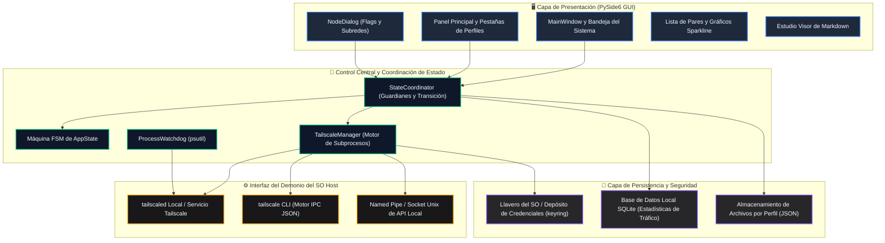
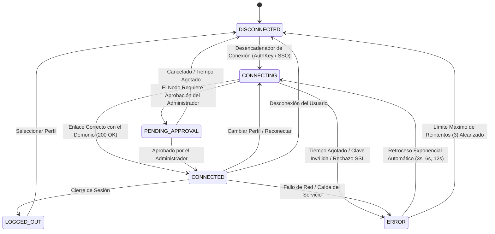
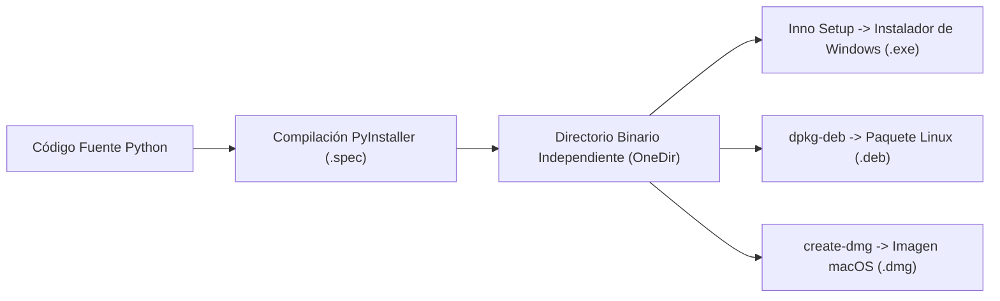

# Tailscale / Headscale Client Pro (Edición Empresarial PySide6)

[](https://tailscale.com) [](https://pyside.org) [](https://github.com/Arean82/Tailscale-Headscale-Client) [](../LICENSE) [](https://www.python.org)

**Tailscale / Headscale Client Pro** es una aplicación GUI de escritorio de alto rendimiento y nivel de producción, diseñada para la coordinación unificada con redes oficiales de **Tailscale** y servidores de control autohospedados de **Headscale**. Desarrollada con **PySide6 (Qt para Python)**, combina una orquestación sólida del demonio, telemetría en tiempo real, almacenamiento criptográfico de tokens y una interfaz receptiva adaptada para implementaciones de misión crítica.

---

## 🏛️ Arquitectura del Sistema

El cliente sigue una estricta separación de responsabilidades entre presentación, coordinación de dominio, ejecución de procesos y almacenamiento persistente:



---

## 🔄 Máquina de Estados y Ciclo de Vida de Conexión

Los estados de conexión se gestionan estrictamente a través de una Máquina de Estados Finitos (FSM) determinista para evitar condiciones de carrera, sockets obsoletos y procesos huérfanos:



---

## ✨ Suite de Características Empresariales

### 🎨 Excelencia Visual y Experiencia de Usuario (UX)
- **Tematización Dinámica QSS Unificada:** Cero estilos codificados en la lógica de Python. Las interfaces se estilizan limpiamente mediante hojas de estilo externas `.qss` (`assets/themes/dark.qss` y `light.qss`).
- **Gráficos Sparkline de Latencia en Tiempo Real:** Gráficos de calidad de conexión suavizados renderizados en cadencias de muestreo de 2 segundos con clasificación automática de estado (`<32ms` verde, `<70ms` ámbar, `>70ms` rojo).
- **Estudio Visor de Markdown Interactivo:** Motor Markdown integrado de alta fidelidad que admite resolución de imágenes locales, listas de verificación de GitHub, formato de tablas y delegación segura de URL externas.
- **Micro-Animaciones de Estado:** Transiciones de ventana suaves, pulso de latido de conexión y retroalimentación contextual durante la sincronización con el demonio.
- **Soporte Multilingüe (i18n):** Internacionalización nativa en inglés (`en_US`), árabe (`ar_SA` con diseño RTL completo), español (`es_ES`) y francés (`fr_FR`).

### ⚡ Potencia y Enrutamiento Inteligente
- **Compatibilidad Dual Headscale + Tailscale:** Totalmente compatible con servidores de control Headscale autohospedados mediante `--login-server=<URL>` y con el plano de control oficial de Tailscale.
- **Opciones Avanzadas de Red Granulares:** Control por perfil de nodos de salida, rutas de subred (`--advertise-routes`), acceso LAN (`--exit-node-allow-lan-access`), preservación de SNAT (`--snat-subnet-routes=false`), anulación de nombre de host y Tailscale SSH.
- **Cuadrícula Receptiva de Indicadores de 2 Columnas:** Controles de características a la izquierda acoplados con insignias de estado en vivo codificadas por color (`True` verde / `False` rojo) para visibilidad en tiempo real del demonio.
- **Autosugerencia de Rutas de Subred:** Al seleccionar un nodo de salida, se extraen automáticamente las rutas anunciadas de la telemetría de pares, eliminando errores manuales.
- **Conmutador en la Bandeja del Sistema:** Cambio de perfil de baja latencia y alternancia de nodos de salida directamente desde el menú contextual de la barra de tareas.
- **Regulación del Sondeo de Tráfico:** La tasa de sondeo de estadísticas de uso de red se reduce dinámicamente cuando la ventana está minimizada para conservar CPU y batería.

### 🛡️ Seguridad y Resiliencia Empresarial
- **Integración con el Llavero del SO:** Las claves de la máquina y los tokens de autenticación se cifran utilizando depósitos seguros nativos de la plataforma (`keyring`: Windows Credential Locker, macOS Keychain, Linux Secret Service).
- **Guardián de Procesos (Watchdog):** Seguimiento de procesos impulsado por `psutil` que elimina procesos CLI huérfanos durante cierres abruptos para evitar colisiones de puertos y estados.
- **Motor de Retroceso Exponencial:** Los intentos automáticos de reconexión se retrasan exponencialmente (`3s`, `6s`, `12s`) para proteger los servidores contra saturación.
- **Tolerancia a SSL Autofirmado:** Configuración SSL dedicada que añade `--insecure-skip-tls-verify=true` para pruebas en entornos aislados de laboratorio.

---

## 📋 Requisitos del Sistema

### Hardware y Plataforma
| Plataforma | Arquitectura | Versión Mínima | Notas |
| :--- | :--- | :--- | :--- |
| **Windows** | x64, ARM64 | Windows 10 (Compilación 19041+) / Windows 11 | PowerShell habilitado |
| **Linux** | x64, aarch64 | Ubuntu 20.04+, Debian 11+, Fedora 36+ | Requiere `systemd` |
| **macOS** | x64, Apple Silicon | macOS 11.0 (Big Sur) o superior | Gestión con `launchctl` |

### Dependencias Principales de Ejecución
- **Python:** Versión `3.10` o superior
- **Demonio de Tailscale:** Servicio en segundo plano (`tailscaled` en Unix, servicio `Tailscale` en Windows) instalado y activo.

---

## 🛠️ Configuración para Desarrolladores y Ejecución

### 1. Clonar Repositorio
```bash
git clone https://github.com/Arean82/Tailscale-Headscale-Client.git
cd Tailscale-Headscale-Client
```

### 2. Configuración del Entorno Virtual
```bash
# Windows (PowerShell)
python -m venv venv
.\venv\Scripts\activate

# Linux / macOS
python3 -m venv venv
source venv/bin/activate
```

### 3. Instalación de Dependencias
```bash
pip install -r requirements.txt
```

### 4. Ejecutar Aplicación
```bash
python main.py
```

---

## 📦 Empaquetado y Distribución para Producción



### Instalador de Windows (Inno Setup)
1. Compilar directorio binario:
   ```powershell
   pyinstaller .\TailscaleClient_OneDir.spec
   ```
2. Compilar instalador usando Inno Setup Compiler (`TailscaleClient_Installer.iss`) para generar:
   `dist\installer\TailscaleClientPro_Setup.exe`

### Distribución Linux (.deb)
```bash
chmod +x build_linux_deb.sh
./build_linux_deb.sh
# Salida: dist/tailscale-client-pro_5.0.0_amd64.deb
```

### Paquete macOS (.dmg)
```bash
chmod +x build_mac_dmg.sh
./build_mac_dmg.sh
# Salida: dist/TailscaleClientPro_Setup.dmg
```

---

## 📄 Licencia

Este software se distribuye bajo la licencia **GNU General Public License v3.0**. Consulte el archivo [LICENSE](../LICENSE) para conocer los términos completos.\n