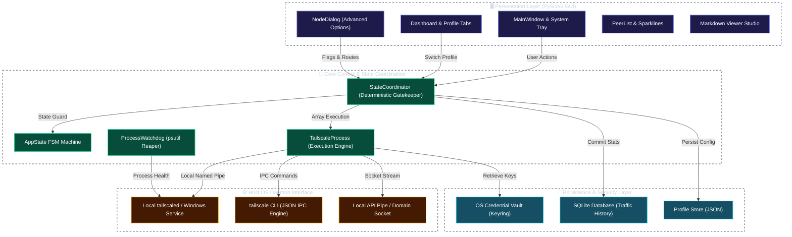
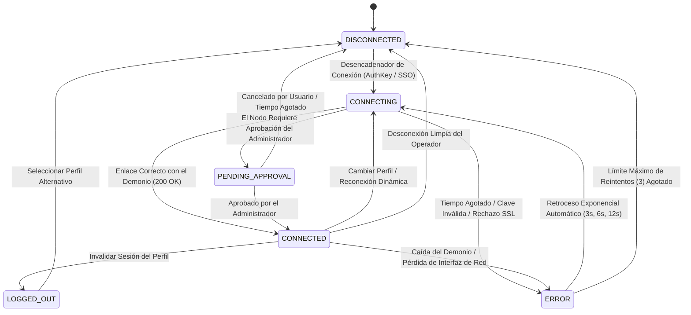
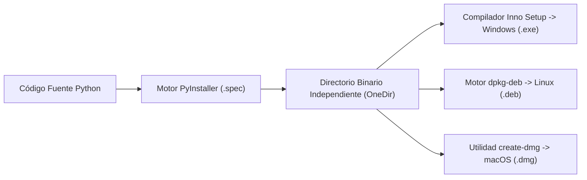

# Tailscale / Headscale Client Pro (Edición Platino Empresarial)

[](https://github.com/Arean82/Tailscale-Headscale-Client)
[](https://tailscale.com)
[](https://pyside.org)
[](https://github.com/Arean82/Tailscale-Headscale-Client)
[](../LICENSE)
[](SECURITY.md)

**Tailscale / Headscale Client Pro** es un cliente de escritorio de nivel de producción y misión crítica, diseñado para una interoperabilidad perfecta entre las redes de control oficiales de **Tailscale** y nodos de orquestación privados autohospedados de **Headscale**.

Construido estrictamente sobre **PySide6 (Qt para Python)** sin sobrecarga de motores web, la aplicación impone ciclos de vida de procesos deterministas, almacenamiento de credenciales seguro sin texto plano, telemetría en tiempo real y controles operativos completos en dos columnas para operaciones confiables sin desvíos.

---

## 🏛️ Especificación de Arquitectura del Sistema

El cliente implementa una arquitectura aislada de múltiples capas que separa la interfaz gráfica de la coordinación de estados, la ejecución del demonio local y los almacenes criptográficos del sistema operativo:



---

## 🔄 Máquina de Estados Finitos (FSM) y Ciclo de Vida de Conexión

El flujo de estados de conexión se gestiona estrictamente mediante una Máquina de Estados Finitos formal y determinista para eliminar condiciones de carrera, bucles duplicados y procesos zombis:



---

## ⚙️ Opciones Avanzadas Empresariales (Matriz de Estado de Dos Columnas)

El diálogo de configuración avanzada `NodeDialog` impone un contrato estricto de dos columnas: la **Columna 0** expone los selectores controlados por el operador, mientras que la **Columna 1** muestra las insignias de estado en vivo del demonio en `#22c55e` (**`True`**) o `#ef4444` (**`False`**):

| Nombre de la Característica | Parámetro CLI Activo | Clave de Badge Columna 1 | Especificación Operativa |
| :--- | :--- | :--- | :--- |
| **Permitir Acceso LAN** | `--exit-node-allow-lan-access` | `chkAllowLANValue` | Retiene acceso Ethernet/Wi-Fi local mientras se enruta a través de un Nodo de Salida. |
| **Habilitar SSH** | `--ssh` | `chkSSHValue` | Habilita el demonio Tailscale SSH administrado por directivas ACL de red. |
| **Aceptar Rutas** | `--accept-routes` | `chkAcceptRoutesValue` | Permite aceptar rutas de subred CIDR anunciadas a través de la Tailnet. |
| **Aceptar DNS** | `--accept-dns` | `chkAcceptDNSValue` | Inyecta dominios de búsqueda MagicDNS y servidores de resolución designados. |
| **Activar Escudos (Shields Up)** | `--shields-up` | `chkShieldsUpValue` | Bloquea todas las conexiones entrantes de otros dispositivos para máxima seguridad. |
| **Ejecutar como Nodo de Salida** | `--advertise-exit-node` | `chkAdvertiseExitNodeValue` | Convierte el equipo local en puerta de enlace predeterminada para el tráfico de la red. |
| **Deshabilitar SNAT** | `--snat-subnet-routes=false` | `chkDisableSNATValue` | Preserva las direcciones IP de origen del cliente para enrutamiento sitio a sitio. |
| **Modo Desatendido** | `--unattended` | `chkUnattendedValue` | Mantiene el demonio activo sin requerir una sesión de usuario de Windows interactiva. |
| **Cliente Web** | `--webclient` | `chkWebclientValue` | Habilita la interfaz de gestión autenticada basada en navegador. |
| **Conector de Aplicaciones** | `--advertise-connector` | `chkAdvertiseConnectorValue` | Designa el dispositivo como proxy de tráfico seguro para recursos SaaS empresariales. |
| **Rutas de Subred** | `--advertise-routes=<CIDR>` | *Campo de Entrada* | Publica subredes RFC 1918 locales (ej. `10.0.0.0/24, 192.168.1.0/24`). |
| **Nombre de Host Personalizado** | `--hostname=<NOMBRE>` | *Campo de Entrada* | Anula el nombre de la máquina en los registros DNS de Headscale/Tailscale. |
| **Reinicio Forzado** | `--reset` | *Flag de Ejecución* | Limpia el estado previo de rutas en el demonio antes de activar el perfil. |
| **Reautenticación Forzada** | `--force-reauth` | *Flag de Ejecución* | Obliga al intercambio completo de claves con el servidor de control. |

---

## 🔒 Arquitectura de Seguridad e Ingeniería de Confianza

1. **Depósito Seguro Sin Texto Plano:** Las claves de máquina, tokens y direcciones sensibles se almacenan en el llavero seguro nativo del sistema operativo mediante `keyring` (Windows Credential Locker, macOS Keychain, Linux Secret Service).
2. **Defensa contra Inyecciones:** Todas las invocaciones CLI se ejecutan mediante vectores de argumentos estrictos (`subprocess.Popen([cmd, arg1, arg2], shell=False)`), neutralizando cualquier inyección en el shell.
3. **Supervisor Automático (Watchdog):** Monitoreo continuo vía `psutil` que cierra de manera limpia procesos CLI huérfanos al salir o cambiar de perfil, previniendo conflictos de puertos.
4. **Retroceso Exponencial Resiliente:** La reconexión automática utiliza pausas progresivas (`3s` -> `6s` -> `12s`) para proteger los servidores contra saturación de tráfico.
5. **Compatibilidad SSL Autofirmado:** Los despliegues de laboratorio con servidores Headscale autohospedados admiten el modo de prueba segura mediante `--insecure-skip-tls-verify=true`.

---

## 📋 Matriz de Compatibilidad del Sistema

| Sistema Operativo | Arquitectura Soportada | Versión Mínima | Gestor de Servicio | Modelo de Privilegios |
| :--- | :--- | :--- | :--- | :--- |
| **Windows** | x86_64, ARM64 | Windows 10 (Compilación 19041+) / Windows 11 | Servicio Windows (`Tailscale`) | Usuario Estándar (Servicio Elevado) |
| **Linux** | x86_64, aarch64 | Ubuntu 20.04+, Debian 11+, Fedora 36+ | `systemd` (`tailscaled.service`) | Grupo `tailscale` / ACL Socket |
| **macOS** | x86_64, Apple Silicon | macOS 11.0 (Big Sur) o superior | `launchd` / `launchctl` | Aislamiento Keychain |

---

## 🛠️ Configuración para Desarrolladores y Verificación

```bash
# 1. Clonar repositorio
git clone https://github.com/Arean82/Tailscale-Headscale-Client.git
cd Tailscale-Headscale-Client

# 2. Configurar entorno virtual dedicado
python -m venv venv

# Windows:
.\venv\Scripts\activate
# Linux / macOS:
source venv/bin/activate

# 3. Instalar dependencias de producción
pip install -r requirements.txt

# 4. Iniciar cliente de desarrollo
python main.py
```

---

## 📦 Empaquetado y Distribución para Producción



### Instalador Empresarial Windows (Inno Setup)
1. Compilar directorio binario:
   ```powershell
   pyinstaller .\TailscaleClient_OneDir.spec
   ```
2. Compilar con Inno Setup (`TailscaleClient_Installer.iss`):
   Salida: `dist\installer\TailscaleClientPro_Setup.exe`

### Distribución Linux Debian (.deb)
```bash
chmod +x build_linux_deb.sh
./build_linux_deb.sh
# Salida: dist/tailscale-client-pro_5.0.0_amd64.deb
```

### Imagen Firmada macOS (.dmg)
```bash
chmod +x build_mac_dmg.sh
./build_mac_dmg.sh
# Salida: dist/TailscaleClientPro_Setup.dmg
```

---

## 📄 Licencia y Gobernanza

Este software se distribuye bajo los términos de la **GNU General Public License v3.0**. Consulte el archivo [LICENSE](../LICENSE) para obtener los términos legales completos y derechos de redistribución.
