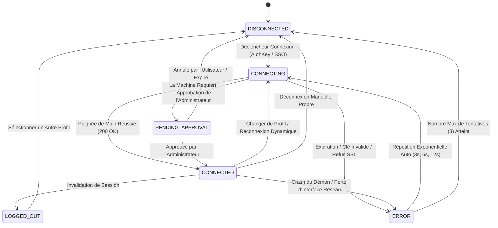
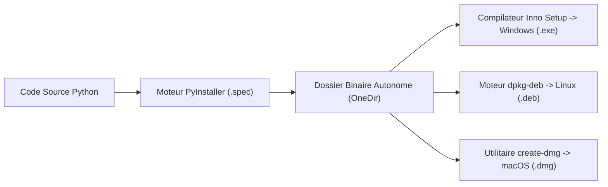

# Tailscale / Headscale Client Pro (Édition Platine Entreprise)

[](https://github.com/Arean82/Tailscale-Headscale-Client)
[](https://tailscale.com)
[](https://pyside.org)
[](https://github.com/Arean82/Tailscale-Headscale-Client)
[](../LICENSE)
[](SECURITY.md)

**Tailscale / Headscale Client Pro** est un client de bureau de niveau entreprise conçu pour les déploiements critiques, assurant une interopérabilité sans faille entre les réseaux officiels **Tailscale** et les serveurs d'orchestration privés auto-hébergés **Headscale**.

Construit rigoureusement sur **PySide6 (Qt pour Python)** sans surcharge de moteur web, l'application applique des cycles de vie de processus déterministes, un stockage sécurisé des identifiants hors texte brut, une télémétrie en temps réel et un panneau de contrôle en deux colonnes pour des opérations d'infrastructure sans dérive.

---

## 🏛️ Spécification de l'Architecture Système

Le client applique une architecture isolée à plusieurs niveaux séparant la présentation de l'interface, la coordination d'état, l'exécution du démon local et les coffres cryptographiques sécurisés du système d'exploitation :

```mermaid
graph TB
    %% Explicit Node Styling - Colors ONLY on Nodes
    classDef uiNode fill:#1e1b4b,stroke:#818cf8,stroke-width:1.5px,color:#ffffff;
    classDef coordNode fill:#064e3b,stroke:#34d399,stroke-width:1.5px,color:#ffffff;
    classDef daemonNode fill:#451a03,stroke:#fbbf24,stroke-width:1.5px,color:#ffffff;
    classDef storageNode fill:#164e63,stroke:#22d3ee,stroke-width:1.5px,color:#ffffff;

    %% 100% Transparent Subgraph Containers (Zero Flood Color)
    style UI fill:none,stroke:#475569,stroke-width:1.5px,stroke-dasharray: 5 5,color:#cbd5e1;
    style Core fill:none,stroke:#475569,stroke-width:1.5px,stroke-dasharray: 5 5,color:#cbd5e1;
    style Daemon fill:none,stroke:#475569,stroke-width:1.5px,stroke-dasharray: 5 5,color:#cbd5e1;
    style Storage fill:none,stroke:#475569,stroke-width:1.5px,stroke-dasharray: 5 5,color:#cbd5e1;

    subgraph UI ["🖥️ Presentation Layer (PySide6 GUI)"]
        MW["MainWindow & System Tray"]:::uiNode
        DB["Dashboard & Profile Tabs"]:::uiNode
        ND["NodeDialog (Advanced Options)"]:::uiNode
        PL["PeerList & Sparklines"]:::uiNode
        RD["Markdown Viewer Studio"]:::uiNode
    end

    subgraph Core ["🧠 Core Control & State Coordination"]
        SC["StateCoordinator (Deterministic Gatekeeper)"]:::coordNode
        SM["AppState FSM Machine"]:::coordNode
        TSM["TailscaleExecutor (Async Execution Seam)"]:::coordNode
        WM["ConnectionStateMachine (State & Retry Owner)"]:::coordNode
    end

    subgraph Daemon ["⚙️ Host OS Daemon Interface"]
        TD["Local tailscaled / Windows Service"]:::daemonNode
        CLI["tailscale CLI (JSON IPC Engine)"]:::daemonNode
        API["Local API Pipe / Domain Socket"]:::daemonNode
    end

    subgraph Storage ["💾 Persistence & Option C Hybrid Vault"]
        KR["OS Credential Vault (Keyring by UUIDv4)"]:::storageNode
        SQL["SQLite Database (profiles, app_settings, traffic)"]:::storageNode
    end

    %% Flow Connections
    MW -->|User Actions| SC
    DB -->|Switch Profile| SC
    ND -->|Flags & Routes| SC
    SC -->|State Guard| SM
    SC -->|Array Execution| TSM
    TSM -->|IPC Commands| CLI
    TSM -->|CLI subprocess (streaming)| TD
    API -.->|"opt-in: Experimental Local API"| TD
    WM -->|Process Health| TD
    SC -->|Persist Config & Topology| SQL
    TSM -->|Retrieve Keys| KR
    SC -->|Commit Stats| SQL
```

---

## 🔄 Machine à États Finis (FSM) et Cycle de Vie de Connexion

Le flux des états de connexion est géré strictement par une machine à états finis déterministe pour éliminer les conditions de concurrence, les boucles redondantes et les processus orphelins :



---

## ⚙️ Options Avancées Entreprise (Matrice d'État à Deux Colonnes)

Le dialogue de configuration avancée `NodeDialog` applique un contrat strict à deux colonnes : la **Colonne 0** propose les sélecteurs modifiables par l'opérateur, tandis que la **Colonne 1** affiche les badges d'état en direct du démon stylisés en `#22c55e` (**`True`**) ou `#ef4444` (**`False`**) :

| Nom de la Fonctionnalité | Paramètre CLI Actif | Clé de Badge Colonne 1 | Spécification Opérationnelle |
| :--- | :--- | :--- | :--- |
| **Autoriser l'Accès LAN** | `--exit-node-allow-lan-access` | `chkAllowLANValue` | Préserve l'accès direct aux périphériques réseau locaux lors de l'utilisation d'un Nœud de Sortie. |
| **Activer SSH** | `--ssh` | `chkSSHValue` | Déploie le serveur démon Tailscale SSH administré par les politiques ACL réseau. |
| **Accepter les Routes** | `--accept-routes` | `chkAcceptRoutesValue` | Active l'acceptation des routes CIDR annoncées sur le réseau Tailnet. |
| **Accepter le DNS** | `--accept-dns` | `chkAcceptDNSValue` | Intègre les domaines de recherche MagicDNS et serveurs résolveurs configurés. |
| **Activer les Boucliers (Shields Up)** | `--shields-up` | `chkShieldsUpValue` | Bloque toutes les connexions entrantes des pairs pour un confinement zéro-trust maximal. |
| **Nœud de Sortie (Exit Node)** | `--advertise-exit-node` | `chkAdvertiseExitNodeValue` | Transforme le poste local en passerelle de sortie internet pour l'ensemble du réseau. |
| **Désactiver SNAT** | `--snat-subnet-routes=false` | `chkDisableSNATValue` | Conserve les adresses IP source d'origine pour le routage direct site-à-site. |
| **Mode Non Supervisé** | `--unattended` | `chkUnattendedValue` | Maintient le démon actif en arrière-plan sans session interactive Windows ouverte. |
| **Client Web** | `--webclient` | `chkWebclientValue` | Active l'interface web locale sécurisée de gestion dans le navigateur. |
| **Connecteur d'Applications** | `--advertise-connector` | `chkAdvertiseConnectorValue` | Désigne la machine comme relais sécurisé vers les applications SaaS d'entreprise. |
| **Routes de Sous-Réseau** | `--advertise-routes=<CIDR>` | *Champ de Saisie* | Publie les sous-réseaux locaux RFC 1918 (ex. `10.0.0.0/24, 192.168.1.0/24`). |
| **Nom d'Hôte Personnalisé** | `--hostname=<NOM>` | *Champ de Saisie* | Remplace le nom de machine enregistré dans le DNS Headscale/Tailscale. |
| **Réinitialisation Forcée** | `--reset` | *Drapeau d'Exécution* | Efface l'état des routes antérieures dans le démon avant de démarrer le profil. |
| **Réauthentification Forcée** | `--force-reauth` | *Drapeau d'Exécution* | Force un échange de clés complet avec le serveur de contrôle en purgeant les sessions. |

---

## ⌨️ 100% Fonctionnement au Clavier Seul et Raccourcis Globaux

Le client offre une navigation complète et sans contrainte exclusivement au clavier, conçue conformément aux normes d'accessibilité d'entreprise (**EN 301 549 Clauses 11.2.1.8 et 11.2.1.2** / **WCAG 2.1 Niveau AA SC 2.1.1, 2.1.2 et 2.4.7**). Tous les composants interactifs disposent d'un liseré de focus visuel à haut contraste de 2px (ratio $\ge$ 3.0:1) sans piège de navigation :

### Raccourcis Clavier Globaux de l'Application

| Combinaison de Touches | Portée / Cible | Action Opérationnelle |
| :--- | :--- | :--- |
| <kbd>Ctrl</kbd> + <kbd>Return</kbd> | Fenêtre Principale / Onglet Actif | Basculer **Connexion / Déconnexion VPN** |
| <kbd>Ctrl</kbd> + <kbd>,</kbd> | Application Globale | Ouvrir le **Dialogue Paramètres** |
| <kbd>Ctrl</kbd> + <kbd>Q</kbd> | Application Globale | **Quitter l'Application** |
| <kbd>Ctrl</kbd> + <kbd>N</kbd> | Application Globale | Modal **Ajouter un Nouveau Profil** |
| <kbd>Ctrl</kbd> + <kbd>Shift</kbd> + <kbd>D</kbd> | Application Globale | **Supprimer le Profil Sélectionné** |
| <kbd>Ctrl</kbd> + <kbd>Shift</kbd> + <kbd>P</kbd> | Application Globale | Ouvrir la **Liste des Pairs (Peers)** |
| <kbd>Ctrl</kbd> + <kbd>Shift</kbd> + <kbd>N</kbd> | Application Globale | Ouvrir le **Dialogue de Diagnostic** |
| <kbd>Ctrl</kbd> + <kbd>Alt</kbd> + <kbd>A</kbd> | Application Globale | Ouvrir les **Options Avancées du Nœud** |
| <kbd>F1</kbd> | Application Globale | Ouvrir la fenêtre **À Propos** |
| <kbd>Shift</kbd> + <kbd>F1</kbd> | Application Globale | Ouvrir le **Lecteur de Documentation & Readme** |

### Navigation du Focus et Contrôle des Dialogues

| Touche | Contexte | Comportement |
| :--- | :--- | :--- |
| <kbd>Tab</kbd> | Toutes Fenêtres et Dialogues | Avancer le focus selon la chaîne stricte `<tabstops>` |
| <kbd>Shift</kbd> + <kbd>Tab</kbd> | Toutes Fenêtres et Dialogues | Reculer le focus selon la chaîne `<tabstops>` |
| <kbd>Enter</kbd> / <kbd>Return</kbd> | Boîtes de Dialogue Modales | Exécuter l'action principale par défaut (`default="true"`) |
| <kbd>Escape</kbd> | Boîtes de Dialogue Modales | Fermer instantanément le dialogue et restituer le focus sans piège |
| <kbd>Espace</kbd> | Case ou Bouton avec Focus | Basculer l'état ou déclencher l'action |
| Flèches <kbd>Haut</kbd> / <kbd>Bas</kbd> | Menus Déroulants et Tables | Changer de profil, sélectionner un nœud de sortie ou parcourir les pairs |

---

## 🔒 Sécurité et Ingénierie de Confiance

1. **Coffre d'Identifiants Sans Texte Brut Persistant :** Les clés de machine et les jetons sont stockés dans les trousseaux du système d'exploitation (`keyring` : Windows Locker, macOS Keychain, Linux Secret Service). Pendant la connexion, la clé est en outre déposée dans un fichier temporaire à permissions restreintes (0600) afin de ne jamais apparaître dans la ligne de commande, puis supprimée dès la fin de la commande. La topologie non sensible (URL du serveur, routes, étiquettes) réside dans la base SQLite locale.
2. **Protection Anti-Injection :** Toutes les commandes CLI sont exécutées via des tableaux d'arguments stricts (`subprocess.Popen([cmd, arg1, arg2], shell=False)`), neutralisant toute injection shell.
3. **Propriété Bornée des Processus :** L'exécuteur suit le processus CLI qu'il lance, le termine à l'arrêt puis retire son thread de travail : aucun processus `tailscale` ne survit à l'application ni ne bloque un changement de profil.
4. **Répétition Exponentielle Résiliente :** La reconnexion automatique applique un échelonnement progressif (`3s` -> `6s` -> `12s`) pour éviter toute surcharge réseau.
5. **Support SSL Auto-Signé :** Les déploiements en environnement de test avec serveurs Headscale auto-hébergés prennent en charge l'option `--insecure-skip-tls-verify=true`.

---

## 📋 Matrice de Compatibilité Système

| Système d'Exploitation | Architecture Prise en Charge | Version Minimale | Gestionnaire de Service | Modèle de Privilèges |
| :--- | :--- | :--- | :--- | :--- |
| **Windows** | x86_64, ARM64 | Windows 10 (Build 19041+) / Windows 11 | Service Windows (`Tailscale`) | Utilisateur Standard (Service Élevé) |
| **Linux** | x86_64, aarch64 | Ubuntu 20.04+, Debian 11+, Fedora 36+ | `systemd` (`tailscaled.service`) | Groupe `tailscale` / ACL Socket |
| **macOS** | x86_64, Apple Silicon | macOS 11.0 (Big Sur) ou supérieur | `launchd` / `launchctl` | Bac à Sable Trousseau OS |

---

## 🛠️ Configuration Développeur & Vérification

```bash
# 1. Cloner le dépôt
git clone https://github.com/Arean82/Tailscale-Headscale-Client.git
cd Tailscale-Headscale-Client

# 2. Configurer l'environnement virtuel dédié
python -m venv venv

# Windows :
.\venv\Scripts\activate
# Linux / macOS :
source venv/bin/activate

# 3. Installer les dépendances de production
pip install -r requirements.txt

# 4. Lancer le client de développement
python main.py
```

---

## 📦 Empaquetage & Distribution en Production



### Installateur Entreprise Windows (Inno Setup)
1. Compiler le dossier binaire :
   ```powershell
   pyinstaller .\TailscaleClient_OneDir.spec
   ```
2. Compiler avec Inno Setup (`TailscaleClient_Installer.iss`) :
   Sortie : `dist\installer\TailscaleClientPro_Setup.exe`

### Paquet Linux Debian (.deb)
```bash
chmod +x build_linux_deb.sh
./build_linux_deb.sh
# Sortie : dist/tailscale-client-pro_5.0.0_amd64.deb
```

### Image Signée macOS (.dmg)
```bash
chmod +x build_mac_dmg.sh
./build_mac_dmg.sh
# Sortie : dist/TailscaleClientPro_Setup.dmg
```

---

## 📄 Licence et Gouvernance

Ce logiciel est distribué selon les termes de la **GNU General Public License v3.0**. Consultez le fichier [LICENSE](../LICENSE) pour les conditions de garantie et les droits de redistribution.
