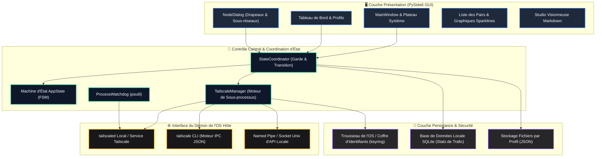
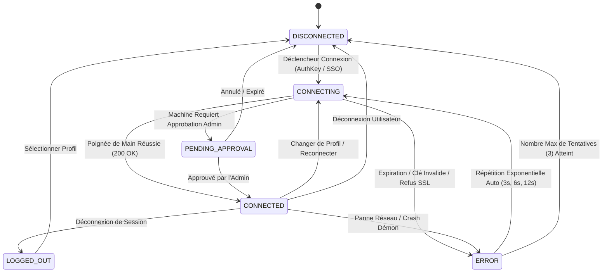
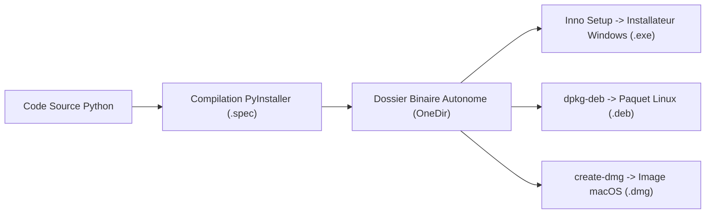

# Tailscale / Headscale Client Pro (Édition Entreprise PySide6)

[](https://tailscale.com) [](https://pyside.org) [](https://github.com/Arean82/Tailscale-Headscale-Client) [](../LICENSE) [](https://www.python.org)

**Tailscale / Headscale Client Pro** est une application GUI de bureau haute performance et prête pour la production, conçue pour une coordination unifiée avec les réseaux officiels **Tailscale** et les serveurs de contrôle auto-hébergés **Headscale**. Développée avec **PySide6 (Qt pour Python)**, elle associe une orchestration robuste du démon, une télémétrie en temps réel, un stockage cryptographique des jetons et une interface réactive conçue pour les déploiements critiques.

---

## 🏛️ Architecture du Système

Le client applique une séparation stricte des responsabilités entre présentation, coordination du domaine, exécution des processus et persistance :



---

## 🔄 Machine d'État et Cycle de Vie de Connexion

Les états de connexion sont rigoureusement pilotés par une machine à états finis (FSM) déterministe pour éliminer les conditions de concurrence, les sockets orphelins et les processus zombies :



---

## ✨ Suite de Fonctionnalités Entreprise

### 🎨 Excellence Visuelle et Expérience Utilisateur (UX)
- **Thématisation Dynamique QSS Unifiée :** Zéro style codé en dur dans la logique Python. Les interfaces sont stylisées proprement via des feuilles de style externes `.qss` (`assets/themes/dark.qss` et `light.qss`).
- **Graphiques Sparklines de Latence en Temps Réel :** Graphiques de qualité de connexion antialiasing échantillonnés toutes les 2 secondes avec classification de santé (`<32ms` vert, `<70ms` orange, `>70ms` rouge).
- **Studio Visionneuse Markdown Interactif :** Moteur Markdown embarqué haute fidélité gérant les images locales, les cases à cocher GitHub, les tableaux et la délégation externe sécurisée d'URL.
- **Micro-Animations d'État :** Transitions douces de fenêtres, battement de cœur de connexion et retour contextuel pendant la synchronisation.
- **Support Multilingue (i18n) :** Prise en charge native en anglais (`en_US`), arabe (`ar_SA` avec mise en page RTL complète), espagnol (`es_ES`) et français (`fr_FR`).

### ⚡ Puissance et Routage Intelligent
- **Compatibilité Double Headscale + Tailscale :** Entièrement compatible avec les serveurs Headscale auto-hébergés via `--login-server=<URL>` et le plan de contrôle officiel Tailscale.
- **Options Réseau Avancées Granulaires :** Contrôle par profil des nœuds de sortie, des routes de sous-réseau (`--advertise-routes`), de l'accès LAN (`--exit-node-allow-lan-access`), du maintien SNAT (`--snat-subnet-routes=false`), du nom d'hôte personnalisé et de Tailscale SSH.
- **Grille Réactive de Drapeaux à 2 Colonnes :** Contrôles à gauche associés à des badges d'état en direct avec code couleur (`True` vert / `False` rouge) pour une visibilité immédiate du démon.
- **Auto-Suggestion Intelligente de Sous-Réseau :** La sélection d'un nœud de sortie extrait automatiquement les routes annoncées à partir des pairs, éliminant toute saisie manuelle.
- **Sélecteur dans la Zone de Notification :** Changement de profil et basculement de nœud de sortie ultra-rapides depuis le menu contextuel de la barre des tâches.
- **Régulation du Sondage de Trafic :** La fréquence de collecte des statistiques réseau ralentit lorsque la fenêtre est réduite pour économiser le CPU et la batterie.

### 🛡️ Sécurité & Résilience d'Entreprise
- **Intégration au Trousseau de l'OS :** Les clés de machine et jetons d'authentification sont chiffrés via les coffres sécurisés du système d'exploitation (`keyring` : Windows Credential Locker, macOS Keychain, Linux Secret Service).
- **Chien de Garde des Processus (Watchdog) :** Surveillance `psutil` arrêtant proprement les processus CLI orphelins lors des fermetures inattendues pour éviter les conflits de ports et d'état.
- **Moteur de Répétition Exponentielle :** Les reconnexions automatiques s'échelonnent exponentiellement (`3s`, `6s`, `12s`) pour protéger les serveurs contre les tempêtes de requêtes.
- **Tolérance aux Certificats SSL Auto-Signés :** Configuration SSL dédiée ajoutant `--insecure-skip-tls-verify=true` pour les environnements de test isolés.

---

## 📋 Prérequis Système

### Matériel & Plateforme
| Plateforme | Architecture | Version Minimale | Remarques |
| :--- | :--- | :--- | :--- |
| **Windows** | x64, ARM64 | Windows 10 (Build 19041+) / Windows 11 | PowerShell activé |
| **Linux** | x64, aarch64 | Ubuntu 20.04+, Debian 11+, Fedora 36+ | `systemd` requis |
| **macOS** | x64, Apple Silicon | macOS 11.0 (Big Sur) ou supérieur | Gestion `launchctl` |

### Dépendances Logicielles Requises
- **Python :** Version `3.10` ou supérieure
- **Démon Tailscale :** Service d'arrière-plan (`tailscaled` sur Unix, service Windows `Tailscale`) installé et actif.

---

## 🛠️ Configuration Développeur & Exécution

### 1. Clonage du Dépôt
```bash
git clone https://github.com/Arean82/Tailscale-Headscale-Client.git
cd Tailscale-Headscale-Client
```

### 2. Configuration de l'Environnement Virtuel
```bash
# Windows (PowerShell)
python -m venv venv
.\venv\Scripts\activate

# Linux / macOS
python3 -m venv venv
source venv/bin/activate
```

### 3. Installation des Dépendances
```bash
pip install -r requirements.txt
```

### 4. Lancement de l'Application
```bash
python main.py
```

---

## 📦 Empaquetage & Distribution en Production



### Installateur Windows (Inno Setup)
1. Compiler le dossier binaire :
   ```powershell
   pyinstaller .\TailscaleClient_OneDir.spec
   ```
2. Compiler l'installateur avec le compilateur Inno Setup (`TailscaleClient_Installer.iss`) pour produire :
   `dist\installer\TailscaleClientPro_Setup.exe`

### Distribution Linux (.deb)
```bash
chmod +x build_linux_deb.sh
./build_linux_deb.sh
# Sortie : dist/tailscale-client-pro_5.0.0_amd64.deb
```

### Image macOS (.dmg)
```bash
chmod +x build_mac_dmg.sh
./build_mac_dmg.sh
# Sortie : dist/TailscaleClientPro_Setup.dmg
```

---

## 📄 Licence

Ce logiciel est distribué sous licence **GNU General Public License v3.0**. Consultez le fichier [LICENSE](../LICENSE) pour les conditions complètes.\n