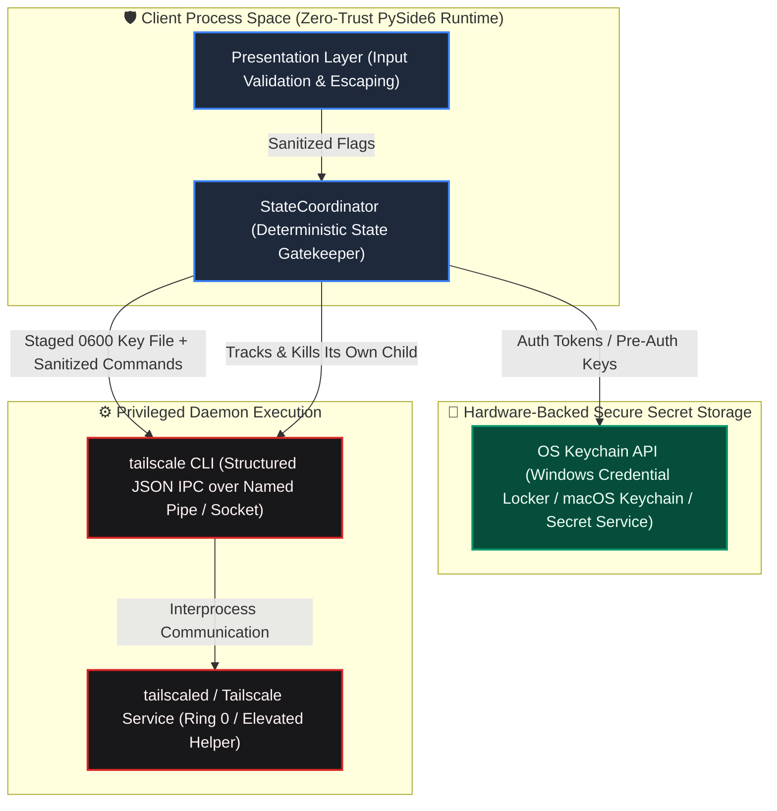

# Enterprise Security Policy & Vulnerability Management

  

**Tailscale / Headscale Client Pro** enforces enterprise-grade security controls across presentation, authentication, cryptographic secrets storage, and process orchestration. This policy outlines supported maintenance lifecycles, our vulnerability remediation SLA, incident coordination protocols, and our zero-trust baseline architecture.

---

## 🔒 Security Architecture & Trust Boundaries

The application isolates credentials, enforces non-plaintext storage, and prevents rogue command injection by decoupling GUI controls from local operating system daemon processes:

### Key Security Safeguards
1. **Zero Persistent Plaintext Secrets:** Auth keys and pre-authentication tokens are persisted **only** through platform-native credential APIs (`keyring`): the OS Credential Locker, macOS Keychain or Linux Secret Service. For the duration of a `tailscale up` invocation the key is additionally staged in a `0600` temporary file and passed as `--auth-key=file:<path>` (rather than on the command line, where every local process could read it); that file is deleted as soon as the command finishes and swept on the next staging if a crash left one behind.
2. **Subprocess Injection Immunity:** All CLI invocations pass parameters as strict tokenized arrays (`subprocess.Popen([cmd, arg1, arg2])`) without shell expansion (`shell=False`), fully neutralizing shell injection vectors.
3. **Bounded Process Ownership:** The executor tracks the CLI child process it starts and kills it during shutdown, then retires its worker thread — so no `tailscale` process outlives the application. `psutil` is used for network interface counters and adapter-change detection only; it does not reap foreign processes.
4. **Transient Command-Line Exposure:** The credential copy handed to the daemon exists only for the duration of the authentication handshake; the profile's persisted copy lives in the OS keyring.

---

## 🛡️ Supported Versions

Only the current active release stream receives official security patches, backports, and vulnerability triage.

| Release Branch | Support Status | Cryptographic Baseline | Maintenance Window |
| :--- | :--- | :--- | :--- |
| **5.0.x (Current)** | `ACTIVE` :white_check_mark: | OS-Level Keyring + TLS 1.3 / WireGuard | Continuous Security Updates |
| **4.x.x (Legacy)** | `END-OF-LIFE` :x: | Deprecated | Unsupported |
| **< 4.0.0** | `END-OF-LIFE` :x: | Deprecated | Unsupported |

---

## ⏱️ Vulnerability Remediation SLAs

Security issues are categorized according to CVSS v3.1 scoring guidelines, with guaranteed triage and patch delivery timelines:

| Severity Level | CVSS v3.1 Range | Initial Triage | Fix & Patch Target | Disclosure Notice |
| :--- | :--- | :--- | :--- | :--- |
| **CRITICAL** | `9.0 - 10.0` | Within 24 hours | 72 hours | Immediate security advisory & binary hotfix |
| **HIGH** | `7.0 - 8.9` | Within 48 hours | 7 days | Synchronized release advisory |
| **MEDIUM** | `4.0 - 6.9` | Within 5 business days | Next minor release cycle | Release notes update |
| **LOW** | `0.1 - 3.9` | Within 10 business days | Scheduled maintenance | General changelog entry |

---

## 🚨 Responsible Disclosure Process

If you discover an actual or potential security vulnerability, **do NOT open a public GitHub issue, discussion thread, or social media post**. Public disclosure before a verified fix places end users at risk.

### Preferred Reporting Channels
1. **GitHub Private Vulnerability Reporting:** Submit a report via the **[GitHub Security Advisories Tab](https://github.com/Arean82/Tailscale-Headscale-Client/security/advisories)** (recommended for end-to-end cryptographic tracking).
2. **Security Contact:** Email the maintainers directly at **`security@arean82.dev`** with the subject tag `[SECURITY] Tailscale-Headscale Client Vulnerability`.

### Information to Include
To expedite validation and mitigation, please provide:
- Detailed description of the vulnerability and attack vector.
- Step-by-step reproduction steps or a minimal Proof-of-Concept (PoC).
- Target OS, client version, and backend setup (Tailscale vs. Headscale version).
- Impact assessment regarding confidentiality, integrity, and availability.

### Coordination Commitment
- We will acknowledge receipt of your vulnerability report within **48 hours**.
- We will provide regular status updates every 72 hours while validation and patching are underway.
- We request that you observe coordinated disclosure guidelines and refrain from publishing details until a validated patch has been officially released.

