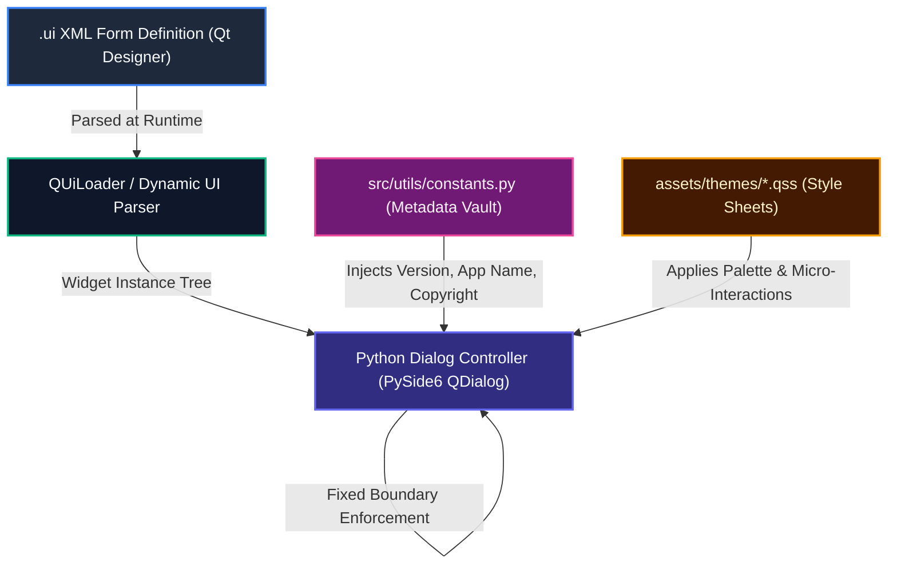

# UI Modification Guide & Widget Architecture Specification

[](https://pyside.org) [](https://github.com/Arean82/Tailscale-Headscale-Client) [](https://github.com/Arean82/Tailscale-Headscale-Client)

This document specifies the strict architectural conventions, dimension constraints, UI-to-Controller binding rules, and metadata injection protocols for **Tailscale / Headscale Client Pro**.

> [!IMPORTANT]
> **Deterministic Layout Policy**: All application dialogs and main panels are configured with explicit, fixed window boundaries (`setFixedSize`) to prevent cross-platform layout clipping, DPI scaling glitches, and uncontrolled responsive drift.

---

## 🏛️ UI-to-Controller Flow Architecture



---

## 📐 Window Dimensions Reference Matrix

All window bounds are strictly managed in Python controller constructors or dedicated UI wrapper modules:

| Window / Dialog | Source Controller File | Dimensions (W × H px) | Primary Purpose |
| :--- | :--- | :--- | :--- |
| **Main Window** | `src/ui/main_window.py` | `420 × 280` | Primary connection toggle, quick stats, tray hub |
| **Node Dialog** | `src/ui/components/node_dialog.py` | `620 × 740` | 2-Column Advanced Flags & Live Status Badges |
| **Readme Studio** | `src/ui/components/simple_dialogs.py` | `1000 × 800` | High-fidelity Markdown documentation viewer |
| **Log Viewer** | `src/ui/components/log_viewer_dlg.py` | `900 × 650` | Real-time streaming subprocess & daemon logs |
| **Peers Dialog** | `src/ui/components/peer_dialog.py` | `850 × 480` | Mesh node telemetry table & latency sparklines |
| **License Dialog**| `src/ui/components/simple_dialogs.py` | `600 × 450` | GPLv3 legal disclaimer and attributions |
| **Traffic Dialog**| `src/ui/components/simple_dialogs.py` | `450 × 500` | Historical throughput and packet statistics |
| **About Dialog**  | `src/ui/components/simple_dialogs.py` | `360 × 280` | Dynamic build metadata & upstream links |
| **Settings Dialog**| `src/ui/components/settings_dialog.py` | `340 × 340` | Preferences, theme, language, and startup options |
| **Add Profile**   | `src/ui/components/profile_name_dialog.py` | `360 × 150` | New environment profile creation modal |
| **Profile Auth**  | `src/ui/components/profile_dialog.py` | `300 × 200` | Login URL / Auth token entry modal |

---

## 🔒 Platinum Quality Directives for UI Modification

### 1. Zero Hardcoding of Application Metadata in `.ui` XML
**NEVER hardcode version numbers, application names, or copyright strings inside `.ui` XML files.**
- XML forms must leave labels blank or use generic placeholders.
- The Python controller layer dynamically fetches metadata from `src/utils/constants.py`:
  ```python
  from src.utils.constants import APP_NAME, APP_VERSION, APP_COPYRIGHT
  
  self.ui.lblVersion.setText(f"Version {APP_VERSION}")
  self.ui.lblCopyright.setText(APP_COPYRIGHT)
  ```

### 2. Two-Column Layout Integrity Contract
In dialogs featuring operational controls and live daemon states (such as `NodeDialog` / `node.ui`):
- **Column 0**: User-editable interactive controls (e.g. `chkShieldsUp`, `chkSnats`, `chkSsh`).
- **Column 1**: Read-only status indicator badges (`chkShieldsUpValue`, `chkSnatsValue`, `chkSshValue`) styled dynamically with:
  - Checked / Active: Bold `#22c55e` (Emerald Green) text: **`True`**
  - Unchecked / Inactive: Bold `#ef4444` (Ruby Red) text: **`False`**
- Do NOT add, rename, or delete widgets without explicit architecture synchronization.

### 3. Separation of Styling and Logic (QSS)
- Do NOT inject inline CSS into widget construction (`widget.setStyleSheet(...)`) unless applying dynamic state badges.
- All structural colors, borders, hover states, and typography belong strictly in `assets/themes/dark.qss` and `assets/themes/light.qss`.

### 4. Technical Rule for Resizability Modifications
If a dialog must be made resizable in a specialized branch:
1. Replace `self.setFixedSize(W, H)` with `self.resize(W, H)`.
2. Explicitly specify minimum bounds via `self.setMinimumSize(MIN_W, MIN_H)` to prevent UI component overlapping.


