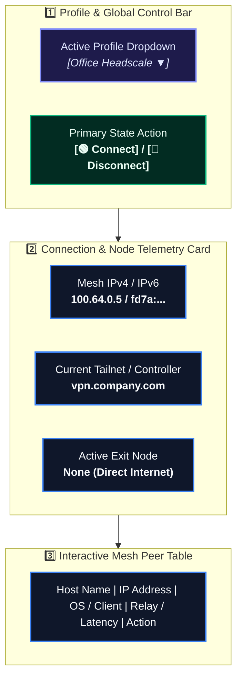
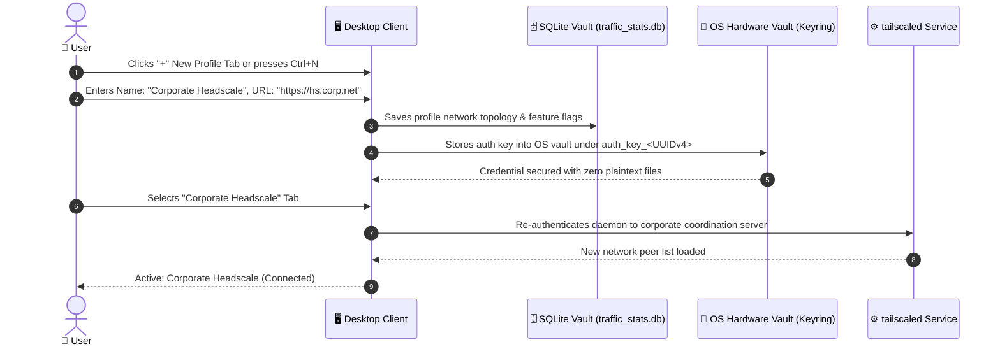
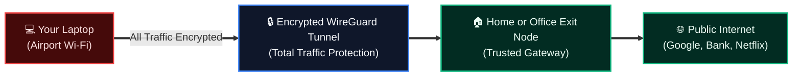

# Tailscale & Headscale Client: Comprehensive User Manual 📖🌐
**Simple, Step-by-Step Guide for Everyday Users, Field Engineers, Remote Workers & IT Admins**

**Document ID:** THC-DOC-USR-2026.1  
**Target Audience:** All Skill Levels (Complete Beginner to Advanced Network Engineer)  
**Tone:** Plain-English, Step-by-Step, Enterprise Certified  

---

## 🌟 What is Tailscale & Headscale?

Think of **Tailscale** like a secure, invisible extension cord that connects your laptop, home computer, office workstation, and cloud servers together—no matter where they are in the world.

* **No Port Forwarding Required:** Works behind strict hotel Wi-Fi, mobile hotspots, and corporate firewalls.
* **Direct & Blazing Fast:** Whenever possible, your devices connect directly to each other using state-of-the-art **WireGuard®** encryption.
* **What is Headscale?** Headscale is an open-source, private server you can host yourself instead of using the official Tailscale cloud service. This desktop client supports **both** seamlessly with instant profile switching!

---

## 👤 Who Uses This App? (User Roles)

| Role | What They Use It For | Everyday Workflow |
| :--- | :--- | :--- |
| **Everyday Remote Worker** | Accessing company files, intranets, and remote desktop | Click **Connect** in morning, forget about it all day, click **Disconnect** when done. |
| **Field Engineer / IT Admin** | Managing servers, SSH access, remote diagnostics | Switch between multiple client Tailnets/Headscale instances, monitor peer latencies. |
| **Privacy & Security Conscious User** | Encrypting public Wi-Fi traffic | Route all internet traffic through a trusted home or cloud **Exit Node**. |
| **Designer / Developer** | Direct peer-to-peer file sharing | Right-click any team member's machine and send files at wire speed with **Taildrop**. |

---

## 🚀 Visual Interface Tour



---

## 🛠️ Step-by-Step User Guides

---

### 1. How to Connect to Your Network (First-Time Connection) 🔌

Connecting takes just one click:

1. Open the **Tailscale & Headscale Client** from your Start Menu, Applications folder, or system tray.
2. In the top-right corner, check the large status button:
   - If it says **`Connect`**, click it! (Keyboard shortcut: <kbd>Ctrl</kbd>+<kbd>C</kbd> or <kbd>Cmd</kbd>+<kbd>C</kbd>).
3. **If using official Tailscale:**
   - Your browser opens to `login.tailscale.com`.
   - Log in using your Google, Microsoft, GitHub, or Apple account.
   - You will see *"Authentication successful! You can close this tab."*
4. The client button turns into **`Disconnect`** and the status badge turns **`Connected (Green)`**.
5. Your computer is now securely linked to your personal mesh network!

---

### 2. How to Add and Switch Between Multiple Profiles 📂

Need to access your **Personal Home Lab** in the morning and **Company Headscale** in the afternoon? Multi-Profile makes switching instantaneous without re-typing credentials!



#### Steps to Add a New Profile:
1. Click the **`➕`** tab button or press <kbd>Ctrl</kbd>+<kbd>N</kbd>.
2. Enter a unique name for the environment (e.g. `Office Work`, `Home Server`, `Client Lab`).
3. Set your credentials:
   * **Login Server URL:**
     * Leave default (`https://controlplane.tailscale.com`) for official Tailscale SaaS.
     * Enter your sovereign Headscale server URL (e.g. `https://headscale.mycompany.com`).
   * **Authentication Method:**
     * **Pre-Auth Key:** Paste your authentication token (e.g. `tskey-auth-...`). The client immediately delegates it to the native OS Credential Vault (`Windows Credential Manager`, `macOS Keychain`, `Linux SecretService`) indexed by an immutable UUIDv4. Zero plaintext secrets touch your disk.
     * **Web Browser SSO:** Check "Use SSO" for interactive single sign-on browser authorization.
4. Click **`Save`**.
5. **Switching Profiles**: Simply click the profile's tab in the top tab bar. The client handles the background handover cleanly without leaking credentials!

---


### 3. Routing All Internet Through an Exit Node (Public Wi-Fi Protection) 🛡️

When you are at a coffee shop, airport, or hotel, attackers on the same Wi-Fi could try to snoop on your connection. An **Exit Node** sends 100% of your web browsing through an encrypted tunnel to a trusted machine (like your home router or office server).



#### How to Enable an Exit Node:
1. Look at the **`Exit Node`** selector dropdown on the main dashboard.
2. Click the dropdown to see all machines in your network that offer exit routing.
3. Select your chosen node (e.g., `home-pfsense` or `aws-us-east`).
4. **Local LAN Access Checkbox:**
   * ✅ **Checked:** You can still print to local Wi-Fi printers or reach your local smart TV.
   * ⬜ **Unchecked:** Maximum privacy; absolutely all traffic is routed through the remote node.
5. Click **`Apply Exit Node`**. You are now browsing securely!
6. To turn it off, select **`None (Direct)`** and click Apply.

---

### 4. Sending Files with Taildrop (Blazing-Fast Direct Transfer) 📦

Forget slow upload links or email attachment limits. **Taildrop** sends files directly between devices at your network's maximum physical speed!

1. In the **Peers Table**, find the computer or phone you want to send a file to.
2. **Right-click** on that peer's row.
3. Click **`Send File via Taildrop...`**.
4. Choose the file from your computer and click Open.
5. A transfer bar shows progress. Once done, the file arrives in the recipient's **Downloads** folder.
6. **Receiving files:** Any file sent to you will trigger an OS desktop notification and appear in your user `Downloads/Taildrop` directory automatically.

---

### 5. Managing Your Own Node Settings ⚙️

Click the **`Settings`** button in the dashboard or press <kbd>Ctrl</kbd>+<kbd>,</kbd> to open node preferences:

| Setting | What It Does | Recommended State |
| :--- | :--- | :--- |
| **Run on System Startup** | Automatically starts the client minimized in the system tray when your PC boots. | ✅ **Enabled** |
| **Minimize to Tray on Close** | Keeps VPN active in the background when you click the window 'X'. | ✅ **Enabled** |
| **Accept Subnet Routes** | Allows your machine to reach internal subnets advertised by gateway nodes (e.g. `192.168.1.0/24`). | ✅ **Enabled** |
| **Allow Inbound Connections** | Permits other authorized machines in your Tailnet to connect to your local services. | Based on security policy |
| **Shields Up (Stealth Mode)** | Completely blocks all incoming connection attempts from other peers. | Enable on untrusted public Wi-Fi |

---

### 6. Reading Diagnostics & System Logs 🔍

If you ever encounter an issue or IT support asks for logs:
1. Click **`Tools`** $\to$ **`Log Viewer`** (or press <kbd>Ctrl</kbd>+<kbd>L</kbd>).
2. The log viewer shows real-time output from the local `tailscaled` service.
3. Use the search bar at the top to filter for errors or warnings (e.g. `derp`, `handshake`, `expired`).
4. Click **`Copy All`** or **`Export Log...`** to save a timestamped diagnostic file for your support team.

---

### 7. Viewing Software License & Attributions ⚖️

To inspect open-source license agreements and copyright terms:
1. Open the **Help** menu and select **`License Agreement`**.
2. The dedicated License Viewer displays the full legal text of the **GNU General Public License v3.0 (GPLv3)**.
3. The dialog features keyboard-first accessibility: dismiss anytime by pressing <kbd>Esc</kbd>, <kbd>Enter</kbd>, or clicking **`Close`**.

---

## ♿ Accessibility & Keyboard Shortcuts Cheatsheet

This software has been certified under **EN 301 549 (Software Clause 11)** and **WCAG 2.1 Level AA**. Every function is 100% operable using only the keyboard or a screen reader (NVDA, JAWS, Windows Narrator, Apple VoiceOver, Orca).

| Key Combination | Action Scope | Operation |
| :--- | :--- | :--- |
| <kbd>Ctrl</kbd> + <kbd>Return</kbd> | Main Window / Active Tab | **Connect / Disconnect VPN** toggle |
| <kbd>Ctrl</kbd> + <kbd>,</kbd> | Application Global | Open **Settings Dialog** |
| <kbd>Ctrl</kbd> + <kbd>Q</kbd> | Application Global | **Quit / Exit Application** |
| <kbd>Ctrl</kbd> + <kbd>N</kbd> | Application Global | **Add New Profile** modal |
| <kbd>Ctrl</kbd> + <kbd>Shift</kbd> + <kbd>D</kbd> | Application Global | **Remove Selected Profile** |
| <kbd>Ctrl</kbd> + <kbd>Shift</kbd> + <kbd>P</kbd> | Application Global | Open **Peer List Dialog** |
| <kbd>Ctrl</kbd> + <kbd>Shift</kbd> + <kbd>N</kbd> | Application Global | Open **Diagnostics Dialog** |
| <kbd>Ctrl</kbd> + <kbd>Shift</kbd> + <kbd>S</kbd> | Application Global | **Check Screen Reader & AT Setup** |
| <kbd>Ctrl</kbd> + <kbd>Alt</kbd> + <kbd>A</kbd> | Application Global | Open **Advanced Node Options** |
| <kbd>F1</kbd> | Application Global | Open **About Dialog** |
| <kbd>Shift</kbd> + <kbd>F1</kbd> | Application Global | Open **Documentation & Readme Viewer** |
| <kbd>Tab</kbd> / <kbd>Shift</kbd> + <kbd>Tab</kbd> | All Windows & Dialogs | Step forward/backward through `<tabstops>` focus chain |
| <kbd>Enter</kbd> / <kbd>Return</kbd> | Modal Dialogs | Execute default primary action |
| <kbd>Esc</kbd> | Modal Dialogs | Instantly close dialog and return focus without keyboard trap |
| <kbd>Space</kbd> | Focused Button/Checkbox | Activate or toggle focused control |
| <kbd>Up</kbd> / <kbd>Down</kbd> Arrows | Tables & Lists | Navigate peer items or profile selections |

---

## 🎙️ Assistive Technology & Screen Reader Setup (Linux & Windows N)

While Windows (Standard) and macOS include built-in screen readers preconfigured in their OS kernels, specific Linux workstation distributions and Windows "N" European editions may require installing the speech synthesis engine:

### 1. Linux Setup (Ubuntu / Debian / Fedora / Arch)

The client communicates directly with the **Orca Screen Reader** via AT-SPI2 / D-Bus:

* **Ubuntu / Debian / Linux Mint**:
  ```bash
  sudo apt update && sudo apt install -y orca at-spi2-core speech-dispatcher
  ```
* **Fedora / RHEL / CentOS Stream**:
  ```bash
  sudo dnf install -y orca at-spi2-core speech-dispatcher
  ```
* **Arch Linux / Manjaro**:
  ```bash
  sudo pacman -S --noconfirm orca at-spi2-core speech-dispatcher
  ```
* **openSUSE**:
  ```bash
  sudo zypper install -y orca at-spi2-core speech-dispatcher
  ```

> **How to toggle Orca**: Press <kbd>Super</kbd> + <kbd>Alt</kbd> + <kbd>S</kbd> (or run `orca --replace &` in terminal).

### 2. Windows N Editions (European Media-Free Editions)

Windows N editions require the Windows Media Feature Pack to enable voice synthesis for **Windows Narrator**:

* **Via Settings**: Open **Settings** $\to$ **Apps** $\to$ **Optional Features** $\to$ **Add a feature** $\to$ select **Media Feature Pack** and install.
* **Via Administrator PowerShell**:
  ```powershell
  DISM /Online /Add-Capability /CapabilityName:Media.MediaFeaturePack~~~~0.0.1.0
  ```

> **How to toggle Windows Narrator**: Press <kbd>Win</kbd> + <kbd>Ctrl</kbd> + <kbd>Enter</kbd>.

### 3. Apple macOS (VoiceOver)
Pre-installed into macOS. Toggle anytime with <kbd>Cmd</kbd> + <kbd>F5</kbd> (or triple-click Touch ID).

### 4. Optional Startup Verification & Diagnostics Tool
* **In Settings (<kbd>Ctrl+,</kbd>)**: Toggle **"Check Screen Reader / AT on Startup"** (default: *Disabled*). When enabled, the client inspects whether Orca or speech components are active upon launch and displays remediation guidance if missing.
* **In Diagnostics (<kbd>Ctrl+Shift+N</kbd>)**: Click **"Check Screen Reader"** at any time to run an instant non-destructive accessibility health check.

---

## ❓ Frequently Asked Questions (FAQ)

#### Q: Does Tailscale slow down my internet connection?
**A:** No! For normal websites (Google, YouTube), your computer connects directly via your standard ISP. Only traffic destined for your private mesh nodes (or when using an Exit Node) goes through the VPN.

#### Q: Why does my status say "Needs Machine Registration"?
**A:** When connecting to a self-hosted Headscale server for the first time, your server administrator must approve your machine. Share the machine key shown on your screen with your administrator, who will run `headscale nodes register`.

#### Q: Can I run this client alongside other VPNs?
**A:** Yes! Because Tailscale uses an isolated overlay network adapter (`100.64.0.0/10`), it operates harmoniously without interfering with standard company VPNs unless both attempt to route the exact same IP subnets.
