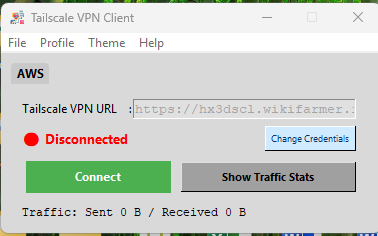
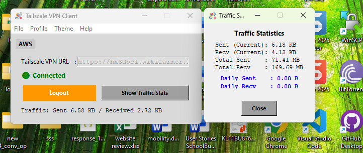
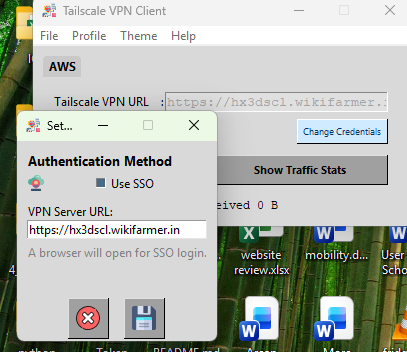

# 🌐 TAILSCALE VPN Client
### *Cross-Platform Tailscale + Headscale Mesh Orchestration*

   

**TAILSCALE VPN Client** is a professional GUI orchestration tool designed to connect Tailscale nodes to a self-hosted **Headscale** server. It replaces the standard cloud-hosted control plane with a local, private interface, offering enhanced privacy, multi-profile management, and real-time traffic analytics.

---

## 📸 Interface Preview

*Modern Tabbed Interface with Real-time Status Monitoring*

---

## 📂 Project Structure

The repository is highly modular, separating UI rendering (PySide6) from core VPN logic and OS-specific functions:

```text
C:.
├── assets/                        # 🖼️ Graphical UI assets & Screenshots
├── assets_cache/                  # ⚡ Cached remote images (Background Loading)
├── pygui/                         # 🎨 Qt Designer .ui files
│   ├── dialogs/                   # Traffic, Settings, About, Profile UI
│   └── windows/                   # Main Window & Tab layouts
├── src/                           # 🖥️ Application Source Code
│   ├── ui/                        # UI Logic (Dashboard, Components)
│   ├── core/                      # Process & Database Management
│   ├── logic/                     # Shared Business Logic
│   ├── utils/                     # Shared Utilities (Logger, Crypto)
│   └── os_specific/               # Platform-specific handlers
├── main.py                        # 🚀 Entry point: Boots GUI
└── requirements.txt               # 📦 Project dependencies
```

---

## ✨ Key Features

* **🚀 Multi-Profile Tabs**: Manage unique Headscale environments simultaneously via a clean interface.
* **📝 Dynamic Global Logging**: Built-in debugging engine viewable through an interactive in-app Log Viewer.
* **📊 Live Traffic Monitoring**: Real-time tracking with persistent daily totals stored in SQLite.
* **🔐 Dual Authentication**: Support for **Auth-Keys** and automated **OIDC (Google SSO)** flows.


---

## 🚀 Getting Started

### 📋 Prerequisites
* **Tailscale**: The Tailscale backend engine must be installed.
* **Headscale Server**: A reachable URL for your private network coordinator.

### 🛠️ Installation
1. **Clone**: `git clone https://github.com/user/Tailscale-Headscale-Client.git`
2. **Install**: `pip install -r requirements.txt`
3. **Launch**: Run `python main.py`



---

## 🛠 Configuration

* **Data Storage**: Profiles and encrypted credentials are stored in `%AppData%/Tailscale_VPN_Client_Pro`.
* **Auto-Connect**: Automatically reconnect the last active profile on launch via `File > Settings`.
* **Diagnostic Logs**: Features auto-scrolling and severity tagging in the Log Viewer.

---

## 📜 Logging & Diagnostics
Navigate to `Logs > Global logs` to view real-time handshake events and background process outputs.

---

## ⚠️ Disclaimer
This project is an independent effort and is **not** officially affiliated with Tailscale Inc. or the Headscale project.
