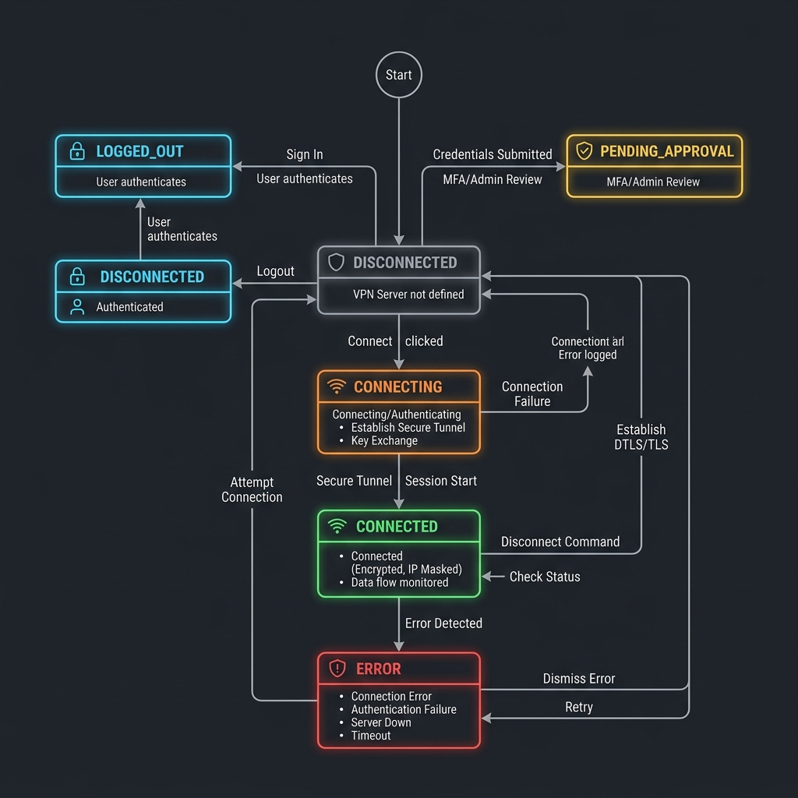

# Tailscale-Headscale Client Pro (PySide6 Edition)

[](https://tailscale.com) [](https://pyside.org) [](https://github.com/Arean82/Tailscale-Headscale-Client) [](LICENSE) [](https://www.python.org)

A professional-grade, high-performance cross-platform GUI client for Tailscale and Headscale. This client combines robust VPN logic with a premium, animated modern interface following enterprise-level separation of concerns.

---

## ✨ Full Feature Suite

### 🎨 Visual & UX Excellence
- **Modern Premium UI:** Clean aesthetic featuring vibrant emerald, ruby, indigo, and amber gradients for intuitive interaction.
- **Namespace & Tag Capsule Badges:** Custom royal blue (🔵) and purple (🟣) pill capsule badges render owner usernames and ACL security tags cleanly next to hostnames inside the Peers List.
- **Real-Time Latency Sparklines:** Beautiful, antialiased latency graphs drawn with `QPainter` that plot connection trends and pulse every 2 seconds with color-coded boundaries (Green `<32ms`, Amber `<70ms`, Red `>70ms`).
- **Responsive Table Wrapping & Scrollbars:** Implemented robust word wrapping and dual-scrollbar policies inside the Peers List to support all resolutions without clipping text.
- **Unified QSS Theming:** Separates layout styling completely from Python code using standalone external `.qss` theme stylesheets (`assets/themes/`).
- **Premium Save & Close Button:** High-end green gradient button with smooth hover and pressed states, offering an elegant tactile feel in the Settings window.
- **Premium Animations:** 
    - Smooth 500ms startup fade-in.
    - Dynamic "heartbeat" pulse for connection states.
    - Universal fade transitions for all dialog windows.
- **Direct Numeric SpinBox:** Integrated a clean, modern `QSpinBox` for setting the Max Profile Limit, supporting easy direct numeric input up to `1000` with automatic layout alignment.
- **Async Image Caching:** High-performance background loading for README badges and images.
- **Smart Setting Interlocking:** Automatically links **Auto-connect on startup** with **Run at startup** dynamically with user confirmation, providing a high-end automated UX.
- **Dynamic Experimental Badge:** Renders a gorgeous `🧪 Experimental API` badge on the main dashboard instantly when Local API is enabled in the settings.

### ⚡ Power Features & Smart Routing (Advanced Features)
- **Granular Exit Node & Subnet Selection:** Advanced options (`node.ui`) per-profile tab allowing customizable `--exit-node` and `--advertise-routes` parameters.
- **Allow LAN Access Toggle (`--exit-node-allow-lan-access`):** Added a secure toggle to access local physical network devices while tunneling through an exit node.
- **Disable SNAT Toggle (`--snat-subnet-routes=false`):** Added a routing subnet toggle to preserve actual client IP addresses in server audit logs.
- **Custom Hostname Overrides (`--hostname`):** Added a customizable input field inside the Node Dialog to append custom node hostname overrides per connection profile.
- **Intelligent Route Auto-Suggestion:** Selecting an exit node instantly queries its advertised IP routes and automatically populates the Subnet Routes field in real-time, eliminating manual copying.
- **Tray Quick Exit-Node Switcher:** Dynamic taskbar context switcher that allows power users to change, toggle, or release active exit-node routing directly from the system tray context menu on right-click.
- **Traffic Monitor Throttling:** Pauses OS statistics polling and database writes when the client window is minimized or hidden in the system tray, optimizing CPU, disk I/O, and battery usage.
- **Native Multi-Account Switching:** Support for rapid native profile swapping (`tailscale switch`) under 0.5s with zero authentication barriers.
- **Automatic Tab Grouping:** Advanced native-switch profiles are automatically arranged side-by-side at the front of the tab bar for perfect visual organization.
- **Smart Tab Locking Matrix:** Connecting to an active native switch profile automatically locks standard custom-server tabs (greying them out), leaving only compatible instant-switch tabs unlocked for complete session safety.
- **Connection Switch Confirmation:** Sleek warning prompts if attempting to initiate a new connection while another is already active to prevent accidental disconnects.

### 🧠 Centralized State Machine & Reliability
- **Formal State Machine Transition Controller:** Drives connection flows cleanly through guarded states (`DISCONNECTED`, `CONNECTING`, `CONNECTED`, `LOGGED_OUT`, `PENDING_APPROVAL`, `ERROR`), completely eliminating race conditions, duplicate timers, and stale state transitions.
- **SSL/MITM Self-Signed Cert Exceptions:** Added a flexible `Allow Self-Signed / Insecure SSL` toggle in the Settings, which dynamically appends `--insecure-skip-tls-verify=true` to standard and reconnect CLI command streams, enabling secure, crash-free operation in self-hosted Headscale home labs.
- **Exponential Backoff Reconnect Policy:** Programmatically retry failed connections at exponentially growing intervals (`3s`, `6s`, `12s`) rather than aggressive reconnect flood loops.
- **SSO Login Timeout Ownership:** Automatically tracks SSO logins and cleanly terminates stale browser authentication tasks.
- **Delta Traffic Tracking:** Advanced persistence logic to prevent data loss across reboots.
- **Cross-Platform Run on Startup:** Modern, independent, real-time registration supporting Windows Registry keys (`HKCU\...\Run`), macOS Launch Agents, and Linux `.desktop` entries.
- **Single Instance Enforcement:** Prevents process collisions with system-wide locking.
- **Credential Masking:** Secure Auth Key storage with an interactive eye-toggle switch.
- **Silent SSO Flow:** Background URL detection (stdout/stderr) for a seamless browser-based login.
- **Process Watchdog:** A robust `psutil`-based watchdog forcefully reaps orphaned background CLI processes upon application shutdown to prevent background leakage.

---

## 📋 System Requirements

To ensure maximum performance and security, your target environment must satisfy the following criteria:

### Software Requirements
*   **Python:** Runtime version **Python 3.10** or higher.
*   **Tailscale Daemon:** The background Tailscale service (`tailscaled` daemon on Unix, or the Windows `Tailscale` Service) must be active.
*   **Operating System Support:**
    *   **Windows 10/11:** Powershell enabled (for best-effort daemon startup commands).
    *   **Linux (Ubuntu/Debian/Fedora):** `systemd` required for autostart service bindings.
    *   **macOS (11.0 Big Sur or later):** `launchctl` required for plist management.

### Python Packages (Included in `requirements.txt`)
*   `PySide6>=6.6.0` (GUI Framework & QUiLoader Core)
*   `psutil>=5.9.0` (Traffic stats, network interface watcher, process watchdog)
*   `keyring>=24.0.0` (Cryptographically secured OS keychain integration)

---

## 🏛️ Comprehensive Technical Specifications

<div align="center">
  
</div>

### Technical Metrics
*   **Idle CPU:** `< 0.1%` (natively achieved via zero-spawning Local API Named Pipe or Unix Sockets).
*   **Status Query Coalescing Cooldown:** `2.0 seconds` (blocks concurrent CLI process spikes).
*   **SSO Login Grace Period:** `120 seconds` (customizable in settings).
*   **Memory Footprint:** `~85 MB RAM` (optimized PySide6 layout structures).

---

## 🛠️ Quick Start & Developer Setup

To run and test the application locally, follow these simple steps:

### 1. Set Up Virtual Environment
```bash
# Create virtual environment
python -m venv venv

# Activate virtual environment
# On Windows:
.\venv\Scripts\activate
# On macOS/Linux:
source venv/bin/activate
```

### 2. Install Dependencies
```bash
pip install -r requirements.txt
```

### 3. Launch Development Client
```bash
python main.py
```

> [!IMPORTANT]
> Ensure the Tailscale background daemon (`tailscaled` on Linux/macOS or the Tailscale Windows Service) is running on your system for the client to establish successful connections.

---

## 📂 Visual Project Structure

```text
📂 Tailscale-Headscale-Client/
├── 🖼️ assets/                     # Icons, logos, and branding assets
│   └── 🎨 themes/                 # Dynamic stylesheet sheets (.qss)
│       ├── 📄 dark.qss
│       └── 📄 light.qss
├── 🎨 pygui/                      # UI Definition Files (.ui)
│   ├── 🪟 dialogs/                # Popup windows
│   │   ├── 📄 about.ui
│   │   ├── 📄 credentials.ui
│   │   ├── 📄 settings.ui
│   │   ├── 📄 node.ui                 # Exit Node & Switch Profile Dialog
│   │   └── 📄 traffic.ui
│   └── 🖼️ windows/                 # Layouts
│       ├── 📄 main_window.ui
│       └── 📄 tab_widget.ui
├── 💻 src/                        # Core Python Source
│   ├── 🧠 core/                   # Backend Logic
│   │   ├── ⚙️ db_manager.py        # Traffic Persistence
│   │   ├── ⚙️ tailscale.py         # Process & SSO management
│   │   ├── ⚙️ cache_manager.py     # Image & State caching
│   │   └── ⚙️ state_coordinator.py # Central State Machine & Watchdogs
│   ├── 🖥️ ui/                     # PySide6 Implementations
│   │   ├── 🧩 components/          # Shared Dialog Logic
│   │   ├── 🧩 dashboard.py         # Tab View logic
│   │   └── 🧩 main_window.py       # Main Application logic
│   └── 🛠️ utils/                  # Helpers
│       ├── ⚙️ constants.py         # Global application constants
│       ├── ⚙️ crypto.py            # Key encryption/decryption
│       ├── ⚙️ logger.py            # Event/Activity Logging
│       ├── ⚙️ local_api.py         # Named Pipes & Unix Sockets Client
│       └── ⚙️ autostart.py         # Native Boot Configuration Manager
├── 📦 TailscaleClient_Installer.iss # Windows Installer Script
├── 📦 build_linux_deb.sh          # Linux Packaging Script
├── 📦 TailscaleClient_Mac.spec      # macOS App Bundle Spec
├── 🚀 main.py                     # Application Entry Point
└── 📖 README.md                   # Documentation
```

---

## 📦 Packaging & Build Commands

### 🪟 Windows (Inno Setup)
1. **Compile Python Binaries:** Ensure `pyinstaller` is installed, then build the executable folder structure:
   ```powershell
   pip install pyinstaller psutil PySide6 keyring
   pyinstaller TailscaleClient_OneDir.spec
   ```
2. **Build Installer:** Launch Inno Setup Compiler and compile `TailscaleClient_Installer.iss` to output the secure, compact `TailscaleClient_Setup.exe` installer with automated desktop and registry bindings.

### 🐧 Linux (Ubuntu/Debian .deb)
1. **Compile Python Binaries:** Ensure your local environment matches the target architecture (e.g. `x86_64`):
   ```bash
   pip install pyinstaller psutil PySide6 keyring
   pyinstaller TailscaleClient_OneDir.spec
   ```
2. **Create Debian Package:** Execute the packaging shell script to organize the binary tree into `/opt/tailscale-client` and compile the `.deb` package:
   ```bash
   chmod +x build_linux_deb.sh
   ./build_linux_deb.sh
   ```
3. **Install Package:**
   ```bash
   sudo dpkg -i dist/tailscale-client_1.0.0_amd64.deb
   ```

### 🍎 macOS (.app Bundle & DMG)
1. **Compile Application Bundle:** Build a standard macOS `.app` bundle:
   ```bash
   pip install pyinstaller psutil PySide6 keyring
   pyinstaller TailscaleClient_Mac.spec
   ```
   *This outputs `TailscaleClientPro.app` inside the `dist/` directory, complete with local `.plist` settings and icon references.*
2. **Create Installable DMG:** Package the app folder into a compressed disk image:
   ```bash
   hdiutil create -volname "Tailscale Client Pro" -srcfolder dist/TailscaleClientPro.app -ov -format UDZO TailscaleClientPro.dmg
   ```
3. **Mount and Distribute:** Users can double-click `TailscaleClientPro.dmg` and drag the application directly to their `/Applications` folder.

---

## 📄 License
This project is licensed under the MIT License - see the [LICENSE](LICENSE) file for details.
