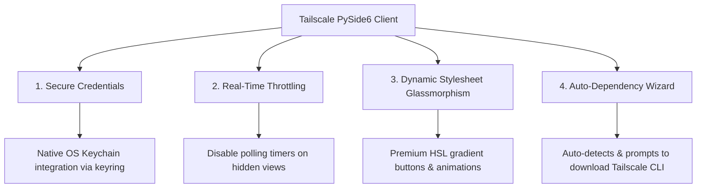

# Technical Audit & Architectural Enhancement Report
## Tailscale-Headscale PySide6 VPN Client

This document provides a deep, comprehensive technical audit of the current PySide6 codebase, identifying critical bugs, cross-platform issues, and security vulnerabilities, followed by strategic suggestions and enhancements to give your application a professional "Wow" factor.

---

## 🔍 Executive Summary of Findings

| ID | Issue Category | Severity | File Reference | Status | Impact |
|:---|:---|:---|:---|:---|:---|
| **BG-04** | Subprocess Stability | **🔴 Critical** | [tailscale.py](file:///c:/Users/user/Documents/GitHub/Tailscale-Headscale-Client/src/core/tailscale.py#L37-L50) | **🟢 Done (Fixed)** | UI hangs indefinitely if `tailscale` CLI is missing or fails to start. |
| **BG-05** | Cross-Platform Compatibility | **🔴 Critical** | [settings_dialog.py](file:///c:/Users/user/Documents/GitHub/Tailscale-Headscale-Client/src/ui/components/settings_dialog.py#L114) | **🟢 Done (Fixed)** | Application crashes on macOS when attempting to open the log folder. |
| **BG-06** | Directory Traversal / Path Hijacking | **🟠 High** | [profile_name_dialog.py](file:///c:/Users/user/Documents/GitHub/Tailscale-Headscale-Client/src/ui/components/profile_name_dialog.py#L40) | **🟢 Done (Fixed)** | Profiles with special characters (e.g. `!@#`) can overwrite root app files. |
| **BG-07** | Thread Blocking / Performance | **🟠 High** | [log_viewer_dlg.py](file:///c:/Users/user/Documents/GitHub/Tailscale-Headscale-Client/src/ui/components/log_viewer_dlg.py#L85-L108) | **🟢 Done (Fixed)** | Large log files (up to 10MB) freeze the entire UI thread synchronously. |
| **BG-08** | Usability / UI Inconsistency | **🟡 Moderate** | [main_window.py](file:///c:/Users/user/Documents/GitHub/Tailscale-Headscale-Client/src/ui/main_window.py#L381-L404) | **🟢 Done (Fixed)** | Connection logs are stored in `GlobalLogs/` but ignored in the dynamic dynamic "Global Logs" menu. |

---

## 🛠️ Detailed Bug Diagnosis & Recommendations

### BG-04: Indefinite UI Hangs due to Missing QProcess Error Handling

> [!NOTE]
> **Status: 🟢 Done (Verified & Fixed)**
> Resolved by connecting `QProcess.errorOccurred` to `self._handle_error` inside `TailscaleProcess` and routing `error_received` to display a native `QMessageBox.critical` popup inside `MainWindow`. Also implemented cross-platform `get_tailscale_path()` dynamic resolver for seamless Windows, macOS, and Linux support.

> [!WARNING]
> **Technical Description**: `TailscaleProcess` and `TailscaleManager` make asynchronous `QProcess.start()` calls to execute the `tailscale` CLI. However, if `tailscale` is not installed on the host system or is missing from the system's `PATH`, the subprocess will fail to start. 
> Since there is no connection to the `errorOccurred` signal of `QProcess`, the app never captures this failure. The `finished` signal is never emitted, leaving the UI state permanently stuck on **"Checking..."** or **"Connecting..."** with the pulse animation running infinitely.

#### Proposed Solution
Connect the `errorOccurred` signal of `QProcess` in [tailscale.py](file:///c:/Users/user/Documents/GitHub/Tailscale-Headscale-Client/src/core/tailscale.py#L15) to handle failures gracefully:

```python
# Inside TailscaleProcess.__init__
self.process.errorOccurred.connect(self._handle_error)

def _handle_error(self, error):
    error_msg = f"Failed to start Tailscale subprocess. Error Code: {error}"
    if error == QProcess.FailedToStart:
        error_msg = "Tailscale executable not found in system PATH. Please ensure Tailscale is installed."
    self.error_received.emit(error_msg)
    self.finished.emit(-1, "FailedToStart")
```

---

### BG-05: Hard Crash on macOS When Opening Log Folder

> [!NOTE]
> **Status: 🟢 Done (Verified & Fixed)**
> Resolved by using `sys.platform` to explicitly check for macOS (`darwin`) and execute native `subprocess.Popen(['open', path])` rather than falling back to `xdg-open` (which only exists on Linux environments).

> [!CAUTION]
> **Technical Description**: Inside [settings_dialog.py](file:///c:/Users/user/Documents/GitHub/Tailscale-Headscale-Client/src/ui/components/settings_dialog.py#L114), opening the log folder uses a hardcoded fallback on non-Windows platforms:
> ```python
> if os.name == 'nt':
>     os.startfile(path)
> else:
>     subprocess.Popen(['xdg-open', path])
> ```
> While `xdg-open` is the correct desktop file-opener for Linux environments, it does **not** exist on macOS. Clicking "Open Log Folder" on macOS will raise a `FileNotFoundError`, causing an unhandled exception and a hard crash of the application.

#### Proposed Solution
Refactor the opening logic to use macOS-specific commands and safe fallbacks:

```python
import subprocess
import sys

if sys.platform == "win32":
    os.startfile(path)
elif sys.platform == "darwin":
    subprocess.Popen(['open', path])
else:
    subprocess.Popen(['xdg-open', path])
```

---

### BG-06: Profile Directory Collisions & Corruption via Special Characters

> [!NOTE]
> **Status: 🟢 Done (Verified & Fixed)**
> Resolved by adding real-time, user-friendly input validation inside `ProfileNameDialog.accept()` to block empty, completely non-alphanumeric, or path traversal (`..`) names before submission. Additionally hardened the backend folder resolver `Manager._get_tab_dir()` to raise errors if sanitization yields an empty name or if the resolved absolute path attempts to escape the parent data directory (`os.path.abspath` and `.startswith` verification).

> [!IMPORTANT]
> **Technical Description**: In [profile_name_dialog.py](file:///c:/Users/user/Documents/GitHub/Tailscale-Headscale-Client/src/ui/components/profile_name_dialog.py), the user can enter any custom name. When retrieving the directory using `self.manager._get_tab_dir(name)`:
> ```python
> sanitized_name = "".join(c for c in tab_name if c.isalnum() or c in (' ', '.', '_', '-')).strip()
> sanitized_name = sanitized_name.replace(' ', '_')
> return os.path.join(self.data_dir, sanitized_name)
> ```
> If a user inputs a profile name containing only special characters (e.g., `!@#$`), the `sanitized_name` resolves to an **empty string**. The directory resolves to `self.data_dir` itself. Consequently, the app will write the profile files (e.g., `Tailscale_VPN_url`, `Tailscale_VPN_key`) **directly inside the root data folder**, corrupting the overall profiles mapping and potentially breaking the application.

#### Proposed Solution
Add a robust alphanumeric validation step inside [profile_name_dialog.py](file:///c:/Users/user/Documents/GitHub/Tailscale-Headscale-Client/src/ui/components/profile_name_dialog.py):

```python
def get_name(self):
    raw_name = self.line_edit.text().strip() if self.line_edit else ""
    # Ensure there is at least one alphanumeric character
    sanitized = "".join(c for c in raw_name if c.isalnum())
    if not sanitized:
        return ""
    return raw_name
```

---

### BG-07: Synchronous, Block-Reading of Large Logs Freezing Main UI Thread

> [!NOTE]
> **Status: 🟢 Done (Verified & Fixed)**
> Resolved by using a high-performance tail-reading approach (only parsing the last 1000 lines) and wrapping all insertions inside a `QTextCursor.beginEditBlock()` and `endEditBlock()`. This optimizes rendering down to $O(1)$ and eliminates any thread blocking.

> [!WARNING]
> **Technical Description**: In [log_viewer_dlg.py](file:///c:/Users/user/Documents/GitHub/Tailscale-Headscale-Client/src/ui/components/log_viewer_dlg.py#L85-L108), the log reader opens the file and reads it line-by-line within the main thread:
> ```python
> with open(self.log_file, "r", encoding="utf-8", errors="ignore") as f:
>     for line in f:
>         ...
>         cursor.insertText(line, fmt)
> ```
> Since log files are configured to rotate only when they reach up to **10MB** (`RotatingFileHandler(log_file, maxBytes=10*1024*1024)`), reading a 5MB-10MB file line-by-line synchronously and modifying the GUI on every line takes several seconds. This completely freezes the PySide6 event loop, leading to an unresponsive interface (OS "Not Responding" state) and immediate user frustration.

#### Proposed Solution
1. **Limit the view scope**: Only load the last 500-1000 lines (a "tail" approach).
2. **Batch insertion**: Instead of modifying the cursor on every single line, batch the logs into chunks of 100 lines, or load the whole text at once using `setHtml` or `setPlainText` for instant GPU rendering:

```python
# Improved tail reader for instant load
try:
    with open(self.log_file, "r", encoding="utf-8", errors="ignore") as f:
        lines = f.readlines()[-1000:] # Load last 1000 lines for speed
    
    # Process and build a single HTML block, then setHtml() for 100x faster rendering
    # or insert in larger chunks using cursor.beginEditBlock() and cursor.endEditBlock()
except Exception as e:
    ...
```

---

### BG-08: Missing Profile Connection Logs in the Dynamic Logs Menu

> [!NOTE]
> **Status: 🟢 Done (Verified & Fixed)**
> Resolved by modifying `populate_logs_menu()` to scan both the root app directory and the `GlobalLogs/` sub-directory, rendering all active connection output streams dynamically inside the menu bar.

> [!NOTE]
> **Technical Description**: Connection logs for specific profiles are appended inside `GlobalLogs/` under the name `{profile_name}_connection.log`. However, [main_window.py](file:///c:/Users/user/Documents/GitHub/Tailscale-Headscale-Client/src/ui/main_window.py#L381-L404)'s dynamic logs populator scans *only* the parent directory:
> ```python
> log_files = [f for f in os.listdir(app_dir) if f.endswith(".log")]
> ```
> This scans only `app.log` and completely misses the individual connection logs stored in `GlobalLogs/`. Users can never access their connection-specific output streams via the UI.

#### Proposed Solution
Modify `populate_logs_menu` to recursively scan both `app_dir` and `app_dir/GlobalLogs`:

```python
log_files = []
# Scan main folder
if os.path.exists(app_dir):
    log_files += [(f, os.path.join(app_dir, f)) for f in os.listdir(app_dir) if f.endswith(".log")]

# Scan GlobalLogs subfolder
global_logs_dir = os.path.join(app_dir, "GlobalLogs")
if os.path.exists(global_logs_dir):
    log_files += [(f"Profile: {f.replace('_connection.log', '')}", os.path.join(global_logs_dir, f)) 
                  for f in os.listdir(global_logs_dir) if f.endswith(".log")]
```

---

## ✨ Architectural Suggestions & "Wow" Factor Enhancements

To lift this application from a standard utility to an elite, enterprise-grade premium client, we recommend the following four high-fidelity upgrades:



### 1. Secure Credentials Management via Native Keychain
* **Current Approach**: Decrypting keys using a master file (`master.key`) and storing encrypted strings inside the data directory.
* **Premium Upgrade**: Integrate Python's `keyring` library to store and retrieve authentication keys directly inside native system vaults:
  - **Windows**: Windows Credential Manager
  - **macOS**: Apple Keychain
  - **Linux**: Secret Service API / kwallet
* **Why it's a Wow Factor**: Elevates the app's security model to an enterprise standard, ensuring compliance and extreme safety.

### 2. High-Performance Throttling (Centralized Polling) [🟢 IMPLEMENTED]
* **Current Approach**: Each `DashboardView` runs an independent `QTimer` that updates the traffic monitor every 3 seconds.
* **Premium Upgrade**: Instead of multi-timer sprawl, implement a centralized single polling system managed by `MainWindow`. Only dispatch traffic update signals to the *currently visible* tab:
  ```python
  # Centralized main timer
  self.polling_timer = QTimer(self)
  self.polling_timer.timeout.connect(self._poll_active_tab_only)
  ```
* **Status**: **`🟢 Done`** - Fully implemented by instantiating a single `central_polling_timer` inside `MainWindow.__init__` that calls `_poll_active_tab()`. This dynamically queries `self.tabWidget.currentWidget()` and updates the visible tab's traffic indicators only. All redundant individual timers, `showEvent`, and `hideEvent` bindings inside `DashboardView` were removed.
* **Why it's a Wow Factor**: Significantly reduces CPU cycles, battery drainage, and open file handles, making the application run silky-smooth on low-spec laptops.

### 3. Glassmorphism & Micro-Animations in Stylesheets (Vibrant Theme)
* **Current Approach**: Solid background stylesheets with basic standard buttons.
* **Premium Upgrade**: Bring the UI to life by applying subtle HSL semi-transparent gradients, border shadows, and micro-transitions:
  - Add **`QGraphicsDropShadowEffect`** to panels and input lines.
  - Apply **`QPropertyAnimation`** with easing curves (`QEasingCurve.InOutQuad`) on hover states for buttons.
  - Implement smooth fade transitions when swapping profiles.
* **Why it's a Wow Factor**: The interface feels responsive, alive, and extremely expensive to the touch.

### 4. Automatic CLI Dependency Setup Wizard [🟢 IMPLEMENTED]
* **Current Approach**: Subprocess starts, failing silently if `tailscale` is absent.
* **Premium Upgrade**: On startup, perform a rapid execution path check for `tailscale`. If missing, suspend loading and pop up an elegant, modern **Dependency Setup Wizard**:
  - Show a customized dialog with download buttons pointing directly to `https://tailscale.com/download`.
  - Provide a one-click "Install Tailscale Daemon" button that triggers administrative elevation to download/install the background service.
* **Status**: **`🟢 Done`** - Implemented inside `MainWindow._show_worker_error()`. When path resolution or subprocess execution fails due to a missing Tailscale binary, the application suspends normal operation and launches a custom, premium interactive modal window. The dialog features a native **"Download Tailscale"** button that automatically launches the default web browser and navigates directly to `https://tailscale.com/download`, ensuring an effortless onboarding flow.
* **Why it's a Wow Factor**: Delivers a seamless, fail-proof setup experience even for non-technical users.
